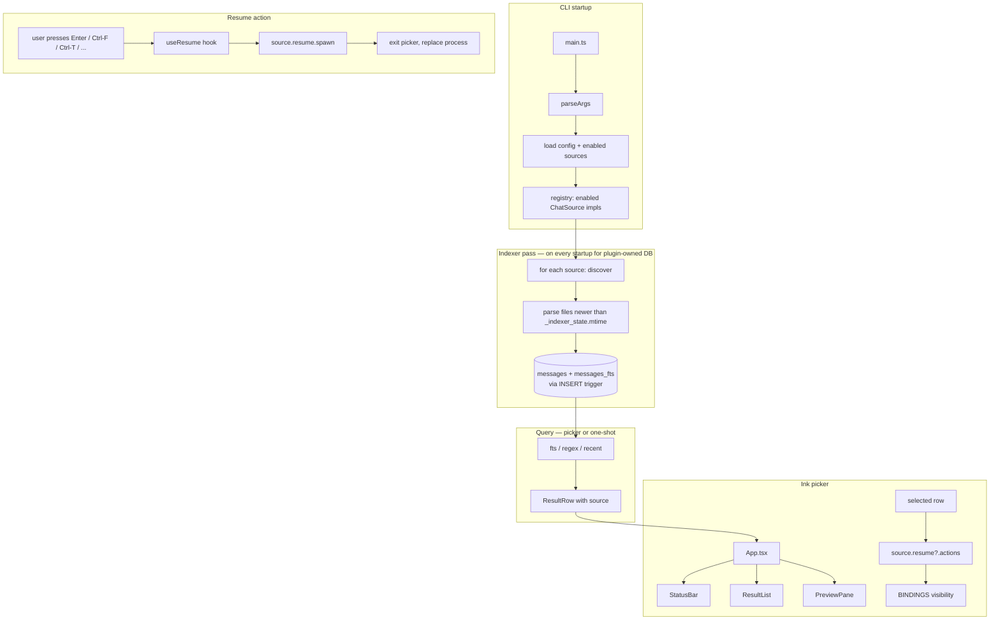

# Multivac architecture refactor: TypeScript, Ink, multi-source

**Status:** Design · **Date:** 2026-05-22 · **Authors:** Shavkat Aynurin (brainstormed with Claude Code)

## Context

`@krmrn42/multivac` (v0.6.0) is a zero-deps Node CLI that indexes Claude Code conversations into a SQLite FTS5 store and exposes a TUI picker plus one-shot search. It ships as a published npm package and embedded in the `chat-search` Claude Code plugin via git-tracked symlinks into `packages/multivac/src/`.

Current source tree (~3,150 LOC across three JS files):

- `src/multivac.js` (1,581 LOC) — CLI entry, arg parsing, FTS search, regex modes, recent-conversation browse, text/TSV output, `init` subcommand.
- `src/picker.js` (1,080 LOC) — hand-rolled raw-mode TTY picker with `readline.emitKeypressEvents` + ANSI sequences. Owns the keybinding table, modes (browse/rename/help), claude/tmux argv builders.
- `src/indexer.js` (484 LOC) — incremental JSONL → SQLite indexer reading `~/.claude/projects/**/*.jsonl`.

The `NAMING.md` decision record (2026-05-19) explicitly scoped multivac to "AI chat archives across tools" and flagged the multi-source future as deferred work. This spec turns that deferred work into a concrete refactor plan.

### Goals

1. Enable multi-source indexing (Claude Code today; Codex CLI, Aider, and similar CLI-native AI coding tools next) without re-architecting per source.
2. Make the picker UI tractable to evolve. The current 1,080-line hand-rolled TUI is a maintenance ceiling — every new mode accreted state and branches into one file.
3. Add a per-tool installation flow (`multivac init <source>`) so each source can ship its own plugin install logic.
4. Introduce type safety to make the cross-file refactor tractable without regressing the externally-visible CLI surface.

### Non-goals

- IDE-embedded chat sources (Cursor, Copilot Chat) are explicitly out of scope. They store data in IDE-private SQLite/log files with no CLI resume hook; the per-source seam should accommodate them in principle, but no impl is planned.
- Web-AI exports (ChatGPT, Gemini, Claude.ai exports) are out of scope. They lack project context, which the schema and picker UX both assume.
- Renaming the package, the binary, the marketplace plugin, or the index file paths. Backward compatibility is a hard constraint.
- Reimagining the search experience itself (fuzzy search modes, multi-select, semantic search). Those are P4+ candidates, not P1.

## Decisions

### D1 — TypeScript + esbuild single-file bundle

Authoring moves to TypeScript; the published artifact is a single bundled CommonJS file at `packages/multivac/dist/multivac.js`. Bundling chosen over `tsc`-emitted tree to keep npm download size small and npx first-run latency sub-second.

Rationale:

- The current zero-deps story can't survive Ink + React additions. Bundling neutralizes the impact at install time — the user downloads one ~250-400KB file, not a `node_modules/` tree.
- Build target `node22.5` matches the existing `engines.node` floor. No transpilation polyfills needed for modern syntax.
- `format: cjs` keeps `require('node:sqlite')` direct. ESM works on Node 22.5+ but the build pipeline stays simpler with CJS.
- `--external:node:*` keeps Node built-ins out of the bundle.

Build artifact (`dist/multivac.js`) is **committed to git**. This is unusual but unavoidable given the dual-distribution shape: the `chat-search` plugin's marketplace install ships from the git tree, and it needs a working binary on clone. A pre-commit hook (`npm run build && git diff --exit-code dist/`) enforces that committed `dist/` matches `src/`.

### D2 — Ink (React for CLI) for the picker

The picker rewrites from imperative ANSI/raw-mode to Ink components. Justified by:

- 1,080 lines of manual `process.stdout.write(ansi.moveTo(...))` is the single biggest UI-evolution pain point in the codebase. Ink's declarative re-render model collapses that into component trees.
- Ecosystem maturity. Ink powers Copilot CLI, GitHub CLI's TUI experiments, npm's installer UI, Prisma's CLI. The shape of "search picker with debounced input, scrollable result list, modal overlays" is well-trodden.
- The existing `deps` object passed through `runPicker(deps)` (db, args, ftsSearch, recentConversations, sessionStore, dangerouslySkipPermissions, tmuxAvailable) is structurally a React Context. The translation is mechanical, not redesign.

Alternative considered: stay imperative, split picker.js into focused modules. Rejected because it doesn't address the underlying UI-evolution ceiling — you'd be re-implementing Ink badly. Bubble Tea-style state machine also rejected for the same reason at lower maturity.

### D3 — ChatSource interface as the per-tool seam

A `ChatSource` interface lives at `src/sources/types.ts`. Each source registers an impl. The indexer, picker, and `init` subcommand all consume the registry, never the concrete sources directly.

```typescript
type SourceId = 'claude' | 'codex' | 'aider' | string;
type ResumeAction = 'resume' | 'fork' | 'dangerous' | 'remote-control' | 'tmux-window';

interface SourceFile {
  path: string;
  mtimeMs: number;
}

interface ChatSource {
  id: SourceId;
  displayName: string;

  // Required: discovery + parse
  discover(): Promise<SourceFile[]>;
  parse(file: SourceFile): AsyncIterable<MessageRow>;

  // Optional: resume capability (Aider has none)
  resume?: {
    actions: ResumeAction[];
    spawn(row: ResultRow, action: ResumeAction, opts: ResumeOpts): SpawnResult;
  };

  // Optional: per-tool installation flow for `multivac init <source>`
  install?: {
    run(): Promise<InstallResult>;
    manualInstructions(): string;
  };
}
```

Rationale:

- **Discovery + parse are required, resume + install are optional.** This matches the scoped source family (CLI-native AI tools): Claude Code and Codex CLI have both, Aider only has discovery + parse (read-only archive).
- **Resume actions are an enum, not freeform.** Today's set (`resume`, `fork`, `dangerous`, `remote-control`, `tmux-window`) covers Claude Code; Codex likely adds nothing new; Aider declares no resume capability. If a future source needs a truly novel action, the enum widens — explicit centralization beats per-source ad-hoc strings.
- **The keybinding capability matrix is data, not branching.** `BINDINGS[i].visible(deps, selectedRow)` consults `selectedRow.source`'s `resume?.actions`. Adding a source with different capabilities is purely declarative.

### D4 — Single DB with `source` column

Index data from all sources lives in one SQLite file with a `source TEXT NOT NULL` column on `messages` and `_indexer_state`. Cross-source ranking remains globally comparable (BM25 over a single FTS5 table). Per-source isolation is a `WHERE source = ?` predicate.

Rejected: per-source DB files. Cross-source ranking would require UNION queries with BM25 scores from independent FTS5 indexes, which are not directly comparable.

Schema migration:

```sql
-- detected on first run by absence of `source` column in PRAGMA table_info(messages)
ALTER TABLE messages       ADD COLUMN source TEXT NOT NULL DEFAULT 'claude';
ALTER TABLE _indexer_state ADD COLUMN source TEXT NOT NULL DEFAULT 'claude';
CREATE INDEX idx_messages_source ON messages(source);
```

Primary-key shape: `messages.id` was `${sessionId}:${uuid}:${blockIdx}`; becomes `${source}:${sessionId}:${uuid}:${blockIdx}`. Migration path is the simplest correct one — when the legacy schema is detected, log a one-line stderr notice and run `fullReindex()`. The full Claude Code reindex on a typical machine takes seconds; UX cost is acceptable, and code complexity stays low.

### D5 — Sessions config keyed by `source:id`

`sessions.json` keys (saved names, pins) become `${source}:${conversationId}`. On first load after the upgrade, a migration pass rewrites bare-id keys to `claude:${id}` and saves atomically via the existing temp-and-rename path.

This is purely defensive against future ID-space collisions between sources. Today's UUID-based Claude Code session IDs would not collide with each other, but Codex CLI's session ID format is independent and could in principle reuse the same shape.

### D6 — Phased release with P1 as a pure refactor

| Phase | Scope | Version | User-visible |
|---|---|---|---|
| **P1** | TS + esbuild + Ink. ChatSource with Claude-only impl. Schema + sessions migration. All current flags + keybindings preserved bit-for-bit. | v0.7.0 | One-time stderr notice on first run as the index migrates; otherwise identical. |
| **P2** | `--source <id>` filter (repeatable). Source filter chip in picker. Source column in TSV output. Per-tool `multivac init <source>`. | v0.8.0 | "Sources" in `--help`; default unchanged when only Claude is installed. |
| **P3** | Codex CLI source (full impl with resume). | v0.9.0 | New source available. |
| **P4** | Aider source (read-only, no resume). Picker hides resume bindings on Aider rows. | v0.10.0 | New source available. |
| **P5+** | UX improvements unlocked by Ink: fuzzy search mode, multi-select, richer preview with message threading. Driven by real-use pain. | v1.0.0 candidate | New keybindings, modes. |

P1 is the safety floor: a pure refactor that ships with byte-identical externally-visible behavior, so any regression is unambiguous and the whole phase is rollback-able.

### D7 — Plugin embedding via committed `dist/` + symlink

The `chat-search` plugin's `bin/multivac` becomes a single symlink into `packages/multivac/dist/multivac.js`. The previous three-symlink layout (`multivac`, `indexer.js`, `picker.js`) collapses to one because the bundled artifact is self-contained.

Considered: have the plugin require a separate `npm install -g @krmrn42/multivac` or `npx`. Rejected because it breaks the current "install the plugin, run `/chat-search:find`" zero-effort UX.

Considered: have the plugin embed a copy of `dist/` rather than a symlink. Rejected as duplication for no gain — pre-commit can enforce a single source of truth more easily than a copy.

## Architecture

```
packages/multivac/
├── src/
│   ├── cli/
│   │   ├── main.ts                # entry point
│   │   ├── args.ts                # OPTIONS table → buildHelp + parseArgs
│   │   ├── validate.ts
│   │   └── exit-codes.ts
│   ├── core/
│   │   ├── db.ts                  # open, probeSchema, detectTimestampScale
│   │   ├── schema.ts              # CREATE TABLE + migrations
│   │   ├── types.ts               # MessageRow, ResultRow, SourceId, ResumeAction
│   │   ├── search/
│   │   │   ├── fts.ts             # ftsSearch
│   │   │   ├── regex.ts           # regexPostfilter, regexScan
│   │   │   ├── recent.ts          # recentConversations + title synth
│   │   │   └── pin-ordering.ts    # applyPinOrdering
│   │   ├── sessions.ts            # sessions.json IO with source-keyed keys
│   │   └── render/
│   │       ├── text.ts            # renderText (one-shot)
│   │       ├── tsv.ts             # renderTsv (one-shot)
│   │       └── preview.ts         # renderPreview (string-producing)
│   ├── sources/
│   │   ├── registry.ts            # known sources, enabled set from config
│   │   ├── types.ts               # ChatSource interface, capability types
│   │   ├── claude/
│   │   │   ├── index.ts           # impl
│   │   │   ├── discover.ts        # listJsonlFiles, currently in indexer.js
│   │   │   ├── parse.ts           # recordToRows, currently in indexer.js
│   │   │   └── resume.ts          # buildClaudeArgs + spawn logic from picker.js
│   │   ├── codex/                 # P3 — stub in P1
│   │   └── aider/                 # P4 — stub in P1
│   ├── indexer/
│   │   ├── runner.ts              # source-agnostic loop, calls source.discover/parse
│   │   ├── state.ts               # _indexer_state CRUD
│   │   └── status.ts              # getIndexStatus + renderIndexStatus
│   ├── tui/
│   │   ├── App.tsx                # top-level Ink component
│   │   ├── components/
│   │   │   ├── PromptLine.tsx
│   │   │   ├── ResultList.tsx
│   │   │   ├── PreviewPane.tsx
│   │   │   ├── StatusBar.tsx
│   │   │   ├── HelpOverlay.tsx
│   │   │   └── RenameModal.tsx
│   │   ├── state/
│   │   │   ├── store.ts           # useReducer-based state
│   │   │   ├── actions.ts
│   │   │   └── keybindings.ts     # BINDINGS table (typed)
│   │   ├── hooks/
│   │   │   ├── useSearch.ts       # debounced query → results
│   │   │   ├── usePreview.ts      # per-row preview cache
│   │   │   ├── useResize.ts
│   │   │   └── useResume.ts       # delegates to source.resume.spawn()
│   │   └── lib/
│   │       ├── width.ts           # truncate/wrap utilities
│   │       └── ansi.ts            # any helpers Ink doesn't cover
│   ├── config/
│   │   ├── load.ts                # XDG_CONFIG_HOME/krmrn42-skills/multivac/config.json
│   │   └── init.ts                # `multivac init <source>` dispatcher
│   └── version.ts                 # generated from package.json at build time
├── test/
│   ├── multivac.test.sh           # existing CLI-surface contract test (stays)
│   ├── unit/                      # node:test based unit tests
│   └── fixtures/
│       └── fake-source/           # fixture ChatSource for end-to-end tests
├── dist/
│   └── multivac.js                # committed build artifact (single file)
├── package.json
├── tsconfig.json
└── esbuild.config.mjs
```

### Data flow



## Migration & backward compatibility

| Surface | Today | After P1 | Migration |
|---|---|---|---|
| CLI flags | All present | All preserved bit-for-bit | None — `--source` is additive in P2. |
| Picker keybindings | Enter, Ctrl-F/O/D/R/P/T/W, Alt-Enter, `?`, Esc | Identical for Claude rows | None. |
| `multivac init` (no arg) | Installs chat-search plugin | Same behavior | None. (P2 adds `multivac init <source>`.) |
| `index.db` schema | `messages` has 9 columns, no `source` | 10th column `source` | ALTER + `fullReindex()` on first run. One-line stderr notice. |
| `sessions.json` keys | `<id>` | `${source}:${id}` | Auto-rewrite on first load; saved atomically. |
| Exit codes (0/1/2/3) | Stable | Stable | None. |
| TSV columns | 7 columns | 8 columns (source added) | TSV consumers may need a header opt-in; P2 evaluates. P1 keeps 7-col output for safety. |
| Plugin `bin/` symlinks | 3 symlinks into `src/` | 1 symlink into `dist/` | Plugin manifest unchanged. Build artifact must be present in the git tree. |

## Error handling

- **Schema migration failure:** if the ALTER TABLE fails (read-only filesystem, locked DB), `dieEnv` with a message pointing at the index path. The original DB is untouched; user can rerun.
- **Source registry empty:** if no sources are enabled, `multivac` runs in source-agnostic mode — useful only for browsing an externally-provided `--db-path`. The default registry always includes Claude Code, so this only triggers when the user has explicitly disabled it.
- **`source.parse` throws on a record:** today's `recordToRows` returns `null` to signal a parse-skip. The new interface preserves that contract: the parse iterable yields rows or omits malformed ones; per-file errors increment `counters.parseSkipsMalformed` exactly as today.
- **`source.resume.spawn` failure:** today the picker writes a single-line `stderr` notice and exits with code 2 (env) or 3 (internal). The new `useResume` hook preserves that, returning the exit code through Ink's `useApp().exit()`.
- **Ink render error:** Ink's default error boundary writes to stderr and exits. Wrap `<App />` in a custom error boundary that calls `teardown()` (alt-screen exit, cursor restore) before re-throwing. Critical for not leaving the user's terminal in a broken state.

## Testing strategy

- **Existing `test/multivac.test.sh`** stays as the CLI-surface contract test. It exercises `--help`, exit codes, `init` dispatch, FTS5 query error handling — all externally observable behavior. P1 must not regress any of these.
- **`MULTIVAC_TEST=1` export hatch** migrates from `module.exports` at the bottom of `multivac.js` to a TS-native test file using `node:test` (stdlib, no new dep). Unit-tests `parseArgs`, `selectMode`, `recentConversations`, `applyPinOrdering`, etc.
- **New unit tests for the ChatSource seam:** a fixture impl at `test/fixtures/fake-source/` that yields synthetic rows. Drives the indexer end-to-end and verifies `WHERE source = ?` partitioning, capability matrix, sessions-key migration.
- **Ink component tests** use `ink-testing-library`. Targets: `StatusBar` rendering with various capability sets; `ResultList` with pinned + unpinned partition + divider; `RenameModal` keystroke routing.
- **Pre-commit hook** runs `npm run build && git diff --exit-code dist/` to enforce `dist/` ≡ `src/`. Also runs `npm test`.

## Open questions

1. **TSV column addition timing.** Adding `source` to TSV breaks naïve `awk '$1' style parsers. P1 keeps 7 columns; P2 decides whether to add it directly (8 cols) or behind a flag (`--tsv-source-column` opt-in) or via a TSV header line. No urgency — defer to when the second source ships.
2. **`MULTIVAC_TEST` name.** With the rewrite to TS the env-hatch can become a build-time flag (`process.env.NODE_ENV === 'test'`) or stay as-is. Lean: keep `MULTIVAC_TEST=1` for shell-test continuity, document it.
3. **Resume action enum width.** If Codex CLI introduces an action that doesn't fit `resume | fork | dangerous | remote-control | tmux-window`, we widen the enum at P3 time, not now.
4. **`config.json` shape.** P1 does not require a config file (Claude is always-on). P2's `--source` flag implies an `enabled: SourceId[]` list; the on-disk default can be empty (= all known sources enabled).

## References

- [`packages/multivac/NAMING.md`](../../../packages/multivac/NAMING.md) — the prior decision committing multivac to "AI chat archives across tools".
- Current sources: [`packages/multivac/src/multivac.js`](../../../packages/multivac/src/multivac.js), [`packages/multivac/src/picker.js`](../../../packages/multivac/src/picker.js), [`packages/multivac/src/indexer.js`](../../../packages/multivac/src/indexer.js).
- Ink documentation: <https://github.com/vadimdemedes/ink>.
- esbuild documentation: <https://esbuild.github.io/>.
- [Repo CLAUDE.md](../../../CLAUDE.md) — commit/merge policy, dual-distribution constraint, version-sync invariant.
