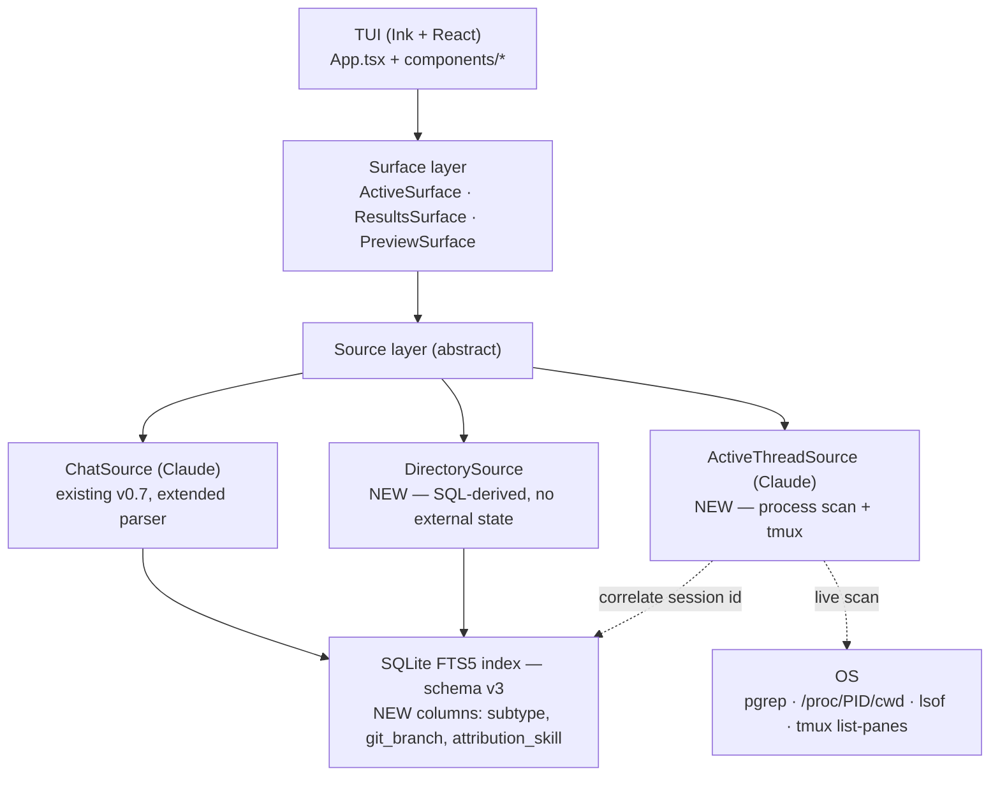

# Multivac dashboard redesign: header strip, unified search, smart previews

**Status:** Design · **Date:** 2026-05-24 · **Authors:** Shavkat Aynurin (brainstormed with Claude Code)

## Context

`@krmrn42/multivac` v0.7.0 (per [2026-05-22 architecture refactor](./2026-05-22-multivac-architecture-refactor-design.md)) replaced a 1,080-LOC hand-rolled ANSI picker with an Ink + React TUI and introduced the `ChatSource` interface as the per-tool seam. The on-screen experience, however, is unchanged in shape: a single result list with a side preview pane, populated either by the user's typed FTS query or by a recent-conversations fallback.

This spec redesigns that experience into a **thread-management dashboard**. The premise: multivac is not really a search tool the user invokes once; it's the surface the engineer keeps reaching for during the day to see what they're working on, what they were just working on, and to start or resume in one keystroke. The current UI serves only the "find a past chat by keyword" journey well. Several other journeys — *what is currently running and where*, *what working dirs do I keep coming back to*, *what does this chat actually contain* — are absent or weakly served.

### What v0.7 already gets right (preserved)

- Sub-second startup; incremental indexer (~30ms typical refresh).
- FTS5 BM25 ranking over message bodies across all projects.
- `Enter` resumes in the conversation's original project dir; `Ctrl-F` forks; `Ctrl-T` remote-control; `Ctrl-W` tmux window; `Ctrl-R` rename; `Ctrl-P` pin; `Ctrl-O` print session id; `Ctrl-D` print project path.
- Two-layer opt-in for `--dangerously-skip-permissions` (Alt-Enter / Shift-Enter).
- `ChatSource` interface — discovery / parse / resume / install separated cleanly; multi-source-ready.
- Schema v2 with `source` column; sessions config keyed by `source:id`.
- Pre-commit hook enforces `dist/` ≡ `src/`; 128 shell tests + 43 unit tests cover the picker, search, indexer, and resume paths.

### What's missing (the dashboard mandate)

1. **No awareness of currently-running AI CLI processes.** Multivac sees only JSONL files on disk; it does not know whether any of them have a `claude` process attached *right now*.
2. **No first-class "working directory" concept.** `--project` filters by substring, but a dir is never a result row; the user can't see "I have 12 chats in `~/work/frontend`" as a unified entity nor open a fresh chat there with one keystroke.
3. **Preview content is bare turn-by-turn.** Claude Code emits `type=system, subtype=away_summary` messages (one-paragraph recaps like "You asked X, I did Y, next: Z"); v0.7's parser ignores `system` rows entirely. Similarly `gitBranch`, `attributionSkill`, and `permissionMode` are present per message in JSONL and discarded.
4. **No layout for the "what am I doing now" glance.** A header strip with the live threads is the layout primitive that's missing.

### Goals

1. **Header strip showing active threads.** Always-visible top region listing running `claude` processes mapped to their project dir, active session, and tmux window when present. Empty-collapsible.
2. **Unified search across chats and working dirs.** One query, three result classes (active threads, working dirs, chats), interleaved with section dividers in the result list.
3. **Smart row previews.** When `away_summary` exists for a chat, surface it. Otherwise show the head of the most recent assistant message. Add a metadata strip per row (branch, active skill, permission mode).
4. **Visual refresh.** Rounded borders, focus-aware accent colors, NO_COLOR conformance, predictable degradation down to 60-col terminals.
5. **Preserve every v0.7 keybinding.** New keys only (`N`, `Tab`, `Shift-Tab`, `r`) — no rebindings. Existing scripts and slash commands keep working.

### Non-goals

- **Multi-source detection** (Aider, Codex CLI, Gemini CLI) is deferred to phase 2. The `ActiveThreadSource` interface accommodates it; the v1 implementation hard-codes Claude.
- **Subagent JSONLs** (`~/.claude/projects/<dir>/subagents/*.jsonl`) remain unindexed. Out of scope for the foreseeable future; tracked as a known limitation.
- **Daemon / always-open dashboard mode.** v1 closes on action like today; if the user wants a persistent dashboard, that's a separate piece of work.
- **Filesystem watchers.** Recursive `fs.watch` on `~/.claude/projects/` is platform-fragile (Linux `inotify` limits, macOS FSEvents semantics). Polling-only.
- **IDE-embedded chat sources** (Cursor, Copilot Chat). Same exclusion as the v0.6 → v0.7 refactor spec.
- **Mouse support, alternate-screen toggling, or kitty-graphics-based renderings.** Keyboard-first, alt-screen-on (today's behavior), pure text glyphs.
- **Renaming the package, binary, marketplace plugin, or any user-visible paths.** Backward compatibility is hard.

## Architecture



The `Surface` layer is the new abstraction: a Surface knows how to fetch a row collection on demand and contribute it to the unified results list (or to the header strip). `Source` is the v0.7 concept extended with two optional capabilities (`discoverActiveThreads`, `discoverDirs`) — DirectorySource is implemented once because it derives from the shared index; ActiveThreadSource is per-source because the process / cwd mapping is tool-specific.

## Decisions

### D1 — Hybrid layout: header strip + unified results + preview pane

The new full-width (`cols ≥ 100`) screen anatomy:

```
multivac >  frontend                                              [12 results]
╭─ Active threads (2) ─────────────────────────────────────────────────────╮
│ 🟢 react-router-fix    ~/work/frontend     tmux:3       12m ago          │
│ 🟢 multivac-redesign   ~/krmrn-skills      pid 41523    just now         │
╰──────────────────────────────────────────────────────────────────────────╯
╭─ Results (focused) ───────────────┬─ Preview ───────────────────────────╮
│ 📁 ~/work/frontend           12   │ ╭ react-router-fix                  │
│    chats: react-router-fix, …    │ │ (main) · superpowers:tdd          │
│                                   │ │ 2026-05-20 → 2026-05-23 · 47 msgs │
│ ▌💬 react-router-fix      47 msgs │ ╰                                    │
│    recap: refactored Router to    │                                      │
│    add error boundary; tested on  │ ▶ user 12:14                         │
│    /settings; merged via PR #142  │   investigate the navigation crash   │
│                                   │   on /settings                       │
│   💬 oauth-debug          12 msgs │ ◀ assistant 12:14                    │
│    ask: frontend OAuth flow…      │   I see three options. (1) add an    │
│    ans: use PKCE with refresh…    │   error boundary at the Route…      │
│                                   │                                      │
│ ── recent (5 more) ──             │                                      │
│   📌 oauth-design          pinned │                                      │
╰───────────────────────────────────┴──────────────────────────────────────╯
 Enter resume   N new-chat   Ctrl-F fork   Ctrl-T remote   Ctrl-R rename   ?
```

**Rationale:** This is the hybrid of two layouts I considered:

- *Multi-panel dashboard (lazygit-shaped)* — too heavy for a tool invoked for 10 seconds at a time; departs too far from v0.7 muscle memory.
- *Search-first with mode cycling (atuin-shaped)* — preserves muscle memory but never lets the user *see* what's running without an extra keystroke.

The hybrid puts active threads at the top where they're always visible at a glance, keeps the search-first interaction unchanged (typing immediately filters the results list below), and degrades cleanly when the screen is narrow or when no threads are active.

**Alternative considered:** Stacking the header strip below the prompt vs. above the result list. Above is correct: the prompt and the header strip together form the "what's happening" zone at the top of the screen; the results + preview are the "what can I do" zone below.

### D2 — Schema v3 migration

Schema bumps from v2 to v3 to accommodate three new per-message columns. The migration drops + recreates the FTS5 virtual table and re-indexes from scratch (consistent with v0.6 → v0.7 precedent).

```sql
-- detected on first run by absence of `subtype` column in PRAGMA table_info(messages)
ALTER TABLE messages ADD COLUMN subtype           TEXT NULL;
ALTER TABLE messages ADD COLUMN git_branch        TEXT NULL;
ALTER TABLE messages ADD COLUMN attribution_skill TEXT NULL;
DROP TABLE messages_fts;
CREATE VIRTUAL TABLE messages_fts USING fts5(
  id UNINDEXED,
  content,
  content='messages',
  content_rowid='rowid'
);
INSERT INTO messages_fts(rowid, id, content) SELECT rowid, id, content FROM messages;
```

The columns are NULL on existing rows after migration; the parser re-populates them on the subsequent indexer pass (which the v0.6→v0.7 precedent already established as user-tolerable).

**Rationale:** Three small columns vs. one JSON blob. Splitting them keeps the schema queryable (`WHERE git_branch = 'main'`) and lets future filters land without further schema work. NULL semantics communicate "not extracted" without ambiguity.

**Alternative considered:** Stuffing all metadata into a single `meta TEXT` JSON column. Rejected because every downstream consumer would need `json_extract()`; the column count is small enough that explicit beats implicit.

### D3 — Parser extensions

`INDEXABLE_TYPES` in `src/sources/claude/parse.ts` extends from `{user, assistant, tool_use, tool_result}` to additionally include `system` **only when** `subtype === "away_summary"`. Other `system` subtypes (`hook_success`, `mcp_instructions_delta`, `skill_listing`, `command_permissions`, etc.) remain silently skipped — they are operational noise the user does not want in FTS results.

Per-message extraction at parse time:

| JSONL key | Destination | Notes |
|---|---|---|
| `subtype` | `messages.subtype` | NULL for user / assistant / tool rows; `"away_summary"` for the system rows we now index |
| `gitBranch` | `messages.git_branch` | NULL when absent (legacy rows) |
| `attributionSkill` | `messages.attribution_skill` | NULL when no skill was active |

The away_summary content lives in the JSONL top-level `content` field (a string), unlike `user` / `assistant` which nest it under `message.content`. Parser handles both shapes.

**Rationale:** Per-message metadata enables the smart preview (D6) and the row metadata strip (D4) without touching the storage layer. Index-time extraction is cheaper than render-time JSON re-parsing and keeps the SQL queries dumb.

### D4 — Three row types with a shared Selectable interface

The result list ingests three row kinds, distinguished by `kind: "chat" | "dir" | "active"`. All three implement `Selectable` so the cursor, key dispatcher, status bar binding filter, and preview pane work uniformly.

```typescript
type Selectable = ChatRow | DirRow | ActiveThreadRow;

interface ChatRow extends ResultRow {
  kind: "chat";
  gitBranch?: string;
  skill?: string;
  permissionMode?: string;
  recapText?: string;   // away_summary | head-of-last-assistant
}

interface DirRow {
  kind: "dir";
  projectPath: string;
  projectName: string;
  chatCount: number;
  lastActivity: number;
  topChatTitles: string[];  // first 3 by recency
}

interface ActiveThreadRow {
  kind: "active";
  source: SourceId;
  pid: number;
  cwd: string;
  sessionId: string | null;        // null when JSONL not yet identifiable
  tmuxPaneId?: string;
  tmuxWindow?: { index: number; name: string };
  lastActivityMs: number;
  status: "live" | "idle";          // mtime-based
}
```

**Visual specs per row** (rendered in the results list — preview pane has its own per-kind layout, see D7):

```
Chat row (3 lines):
 💬 react-router-fix              ~/work/frontend  3h ago  47 msgs
    (main) · superpowers:tdd · permission=dangerous
    recap: refactored Router to add error boundary; merged via PR #142

Directory row (2 lines):
 📁 ~/work/frontend                              12 chats   3h ago
    react-router-fix · oauth-debug · deploy-staging · 9 more

Active thread row (1 line, header strip only):
 🟢 react-router-fix    ~/work/frontend     tmux:3       12m ago
```

When matched by an FTS query, the chat row's third line is replaced with the BM25 snippet (today's `<<<>>>` highlighted span) rather than the recap.

**Rationale:** A shared interface keeps the action dispatcher and binding filter declarative. The three visual specs differ deliberately — different row kinds carry different information density and warrant different vertical space.

### D5 — ActiveThreadSource: process discovery + tmux correlation

The hardest unknown in this design. The implementation lives at `src/sources/claude/active.ts` (sibling to `discover.ts` and `parse.ts`).

**Linux discovery:**

```typescript
// 1. Find candidate PIDs
const pids = await spawnCapture("pgrep", ["-f", "^claude($| )"]);

// 2. For each, read cwd from /proc
for (const pid of pids) {
  const cwd = await readlink(`/proc/${pid}/cwd`);

// 3. Map cwd → projects-dir encoding → newest JSONL by mtime
  const encoded = cwd.replace(/\//g, "-");  // matches Claude Code's own encoding
  const dir = path.join(projectsRoot(), encoded);
  const jsonls = await listJsonlsByMtime(dir);
  const live = jsonls[0];  // newest

// 4. Classify by mtime age
  const age = Date.now() - live.mtimeMs;
  const status: "live" | "idle" =
    age < 60_000 ? "live" :
    age < 30 * 60_000 ? "idle" :
    null;  // drop the row
}
```

**macOS discovery:** identical flow but uses `lsof -p ${pid} -d cwd -F n` and parses the last `n`-prefixed line. The fork is contained in `readProcessCwd(pid)`; the rest of the pipeline is shared.

**Tmux augmentation** (only when `$TMUX` env var is set):

```bash
tmux list-panes -a -F '#{pane_id}\t#{pane_pid}\t#{pane_current_command}\t#{window_id}\t#{window_index}\t#{window_name}'
```

Cross-reference the `pane_pid` set with the active-thread PID set. For matches, attach `tmuxPaneId` + `tmuxWindow` to the row. The match is on **pane PID**, not the claude PID directly — tmux reports the leader process of the pane (usually the shell), and `claude` is a descendant. So we walk each active-thread PID's parent chain (via `/proc/${pid}/stat` field 4 on Linux, or `ps -o ppid=` on macOS) up to 5 levels and match the first ancestor that appears in the `pane_pid` set. Five levels comfortably covers the realistic chain `shell → claude → child_process`; deeper chains imply the user is doing something exotic (nested tmux, screen-inside-tmux) and graceful no-match is acceptable.

**Refresh strategy:**

- Scan once synchronously on picker open (~5ms for 20 PIDs).
- Background interval every 4s via `setInterval`; recompute the full `ActiveThreadRow[]` and re-render if the array changed (deep-equal on the sorted-by-PID rows: PID set, status, lastActivityMs bucket, tmux assignment). A status change from `live` to `idle` therefore triggers a re-render even without a PID change.
- `r` keypress force-refreshes outside the interval.
- No filesystem watcher in v1.

**Display when empty:**

```
╭─ Active threads (0) ─────────────────────────────────────────────────────╮
│ · No active threads · type N to start a new chat · ? for help            │
╰──────────────────────────────────────────────────────────────────────────╯
```

The strip remains visible (collapsing it would shift the layout each time a thread starts/stops).

**Rationale:** mtime is the load-bearing assumption. It works because Claude Code writes to the JSONL on every turn, so the gap between writes rarely exceeds 30 seconds when the human is actively engaged. It fails on long-running tool calls (a 5-minute pytest run will mark a session "idle" mid-conversation). The `idle` status with the yellow indicator is the honest representation of that uncertainty — we don't pretend to know which side of "is this currently being typed in" we're on.

**Alternative considered:** Using inotify / FSEvents for filesystem watch. Rejected: cross-platform fragility (Linux watch limits, macOS FSEvents quirks), marginal accuracy gain (4-second polling is already plenty for human-paced work), and a watcher would add complexity to the lifecycle (start / stop / re-init on picker close-and-reopen).

### D6 — Smart preview content: away_summary first, last-assistant head fallback

When rendering a chat row's preview text (the third line in the result list AND the preview pane header), the data layer queries in priority order:

```sql
-- Step 1: most recent away_summary, if it comes AFTER the last user message
WITH last_user AS (
  SELECT MAX(timestamp) AS ts
  FROM messages
  WHERE conversation_id = ? AND source = ? AND type = 'user'
)
SELECT content FROM messages, last_user
WHERE conversation_id = ? AND source = ?
  AND type = 'system' AND subtype = 'away_summary'
  AND timestamp > last_user.ts
ORDER BY timestamp DESC LIMIT 1;
```

If no row, fall back:

```sql
-- Step 2: head of the most recent assistant message
SELECT content FROM messages
WHERE conversation_id = ? AND source = ? AND type = 'assistant'
ORDER BY timestamp DESC LIMIT 1;
```

Take the first 5 visible lines (after wrapper-stripping and collapsing whitespace).

**Why "after the last user message"?** Claude emits `away_summary` periodically during a session (when the user has been away). If the user then asks a follow-up question, the recap is stale until Claude emits a new one. The freshness filter ensures we never show a recap that pre-dates the most recent user input.

**Rationale:** The user explicitly directed this rule. away_summary content is purpose-built recap text; everything else is heuristic. The fallback is "head of last assistant message" rather than "tail of last message" (today's behavior) because the *start* of Claude's reply is its thesis, while the tail is often the closing pleasantry or final code block.

**Alternative considered:** Synthesizing recaps via an embedding model or LLM call. Rejected: violates the zero-runtime-dependencies ethos and adds privacy surface (a multivac invocation should not send chat content anywhere).

### D7 — Preview pane content per row kind

| Row kind | Preview pane layout |
|---|---|
| Chat | Header box (title · branch · skill · date range · msg count) + first 20 message-turn render (today's `renderPreview` from `src/core/render/preview.ts`) |
| Dir | Header box (path · chat count · branches touched) + top-5 recent chats list with their recap snippets + hint "Enter: new chat here" |
| Active | Header box (status · cwd · pid/tmux · last write) + last 6 user/assistant turns of the live session (re-queried each refresh interval) + hint "Enter: switch to tmux:N" or "Enter: print PID+cwd" |

Mockups:

```
─ Chat row preview ───────────────────────────
╭─ react-router-fix ────────────────────────╮
│ (main) · superpowers:tdd                  │
│ 2026-05-20 → 2026-05-23 · 47 msgs         │
╰───────────────────────────────────────────╯

▶ user 12:14
  investigate the navigation crash on /settings
◀ assistant 12:14
  I see three options. (1) add an error boundary…
…
```

```
─ Dir row preview ────────────────────────────
╭─ ~/work/frontend ─────────────────────────╮
│ 12 chats · last 3h ago                    │
│ branches: main, feat/router-fix           │
╰───────────────────────────────────────────╯

Recent chats here:
  💬 react-router-fix    3h ago  47 msgs
     recap: refactored Router to add error boundary
  💬 oauth-debug         1d ago  12 msgs
     ask: frontend OAuth flow
  💬 deploy-staging      3d ago   8 msgs

(Enter: new chat here)
```

```
─ Active thread preview ──────────────────────
╭─ 🟢 react-router-fix ─────────────────────╮
│ ~/work/frontend (main)                    │
│ tmux: window 3 · PID 41523                │
│ live · last write 12s ago                 │
╰───────────────────────────────────────────╯

Recent turns:
▶ user 12:14   investigate the navigation crash…
◀ assistant 12:14   I see three options…
▶ user 12:18   yes go with option 2
◀ assistant 12:18 (typing…)

(Enter: switch to tmux:3)
```

**Rationale:** Each preview answers the question the user is asking when they highlight that row kind. For a chat: "what was this about?" For a dir: "what's been happening here?" For an active thread: "what's going on right now?"

### D8 — DirectorySource: SQL-derived, no external state

DirectorySource implements no `discover` / `parse` — it's purely a query against the existing `messages` table:

```sql
SELECT
  project_path,
  MAX(project_name) AS project_name,
  COUNT(DISTINCT conversation_id) AS chat_count,
  MAX(timestamp) AS last_activity
FROM messages
WHERE type IN ('user', 'assistant')
GROUP BY project_path
ORDER BY last_activity DESC;
```

Search-time filter:

```sql
... WHERE LOWER(project_path) LIKE '%' || ? || '%'
     OR  LOWER(project_name) LIKE '%' || ? || '%'
```

Top chat titles per dir (used for the row's second line):

```sql
SELECT conversation_id, MAX(timestamp) AS ts
FROM messages
WHERE project_path = ? AND type IN ('user', 'assistant')
GROUP BY conversation_id
ORDER BY ts DESC LIMIT 3;
-- then per-conversation: existing synthesizeTitle / saved-name lookup
```

**Rationale:** Zero new external state. Existing index already has everything needed. The query is O(distinct project_path) which on a typical machine is dozens of paths, not thousands.

**Alternative considered:** A separate `projects` table denormalized at indexer time. Rejected: redundant data, drift risk during partial indexer failures, no performance need.

### D9 — Unified search semantics

Typing `frontend` triggers three queries in parallel (or sequentially for simplicity in v1 — they're all fast):

1. **FTS over chats** — today's `ftsSearch()` unchanged
2. **Substring over dirs** — DirectorySource search query (D8)
3. **Substring over active threads** — in-memory filter on the `ActiveThreadRow[]` by cwd or sessionId

Results interleave in one list with section dividers:

```
── active matches (1) ──
🟢 react-router-fix  ~/work/frontend  tmux:3  12m ago

── working dirs (1) ──
📁 ~/work/frontend  12 chats  3h ago

── chats (10, by relevance) ──
💬 react-router-fix  …
💬 oauth-debug  …
…
```

**Section rules:**

- Empty sections are suppressed (no header).
- Dividers omitted entirely when only one section has matches.
- Order is fixed: active → dirs → chats. The user's eye should always know where each kind appears.
- Within a section, ordering is by relevance (chats: BM25; dirs: substring match score then recency; active: recency).
- The cursor lands on the first row of the first non-empty section by default.

**Empty query (no FTS):** dirs section shows recent dirs, chats section shows recent-N (today's behavior); active section shows all active threads. This is the dashboard's "default landing view".

**Rationale:** Section dividers solve the "how do I know what kind this row is" question without per-row icons doing all the work (the icon is reinforcement, the divider is structure). Fixed section order beats relevance-mixed ordering because the user's first scan is "did I find any matches at all" and that's faster with stable sections.

**Alternative considered:** A single flat list with no dividers, relying on row icons + indentation. Rejected because dirs are useful precisely when you scan and see "oh, that working dir exists" — a flat list buries that scan-ability under chat density.

### D10 — Keybindings: preserve v0.7, add four

The full v0.7 keybinding set is preserved verbatim. New keys:

| Key | Action | Available on |
|---|---|---|
| `N` | new chat in the row's dir (chat: chat's project dir; dir: that dir; active: active's cwd) | all rows |
| `Tab` | cycle focus: header strip ↔ results list | always (preview pane is never focused) |
| `Shift-Tab` | reverse cycle | always |
| `r` | force-refresh active threads | always |

The status bar continues to show only bindings valid for the **currently-selected** row (today's logic, extended). Action availability matrix:

| Key | Chat row | Dir row | Active thread row |
|---|---|---|---|
| `Enter` | resume | new chat here | switch to tmux:N (else print PID+cwd) |
| `Alt/Shift-Enter` | dangerous resume (armed) | — | — |
| `N` | new chat in chat's dir | new chat here | new chat in active's cwd |
| `Ctrl-F` | fork | — | — |
| `Ctrl-T` | remote-control | — | — |
| `Ctrl-W` | tmux new-window | tmux new-window | — |
| `Ctrl-R` | rename | — | — |
| `Ctrl-P` | pin | — | — |
| `Ctrl-O` | print session id | — | print session id |
| `Ctrl-D` | print project path | print path | print cwd |
| `Tab` / `Shift-Tab` / `r` | always available | | |

**Rationale:** Preservation is contract — users have muscle memory and scripts depending on these keys. The four additions are the minimum needed to expose the new layout's capabilities without overloading existing keys.

**Alternative considered:** Repurposing rarely-used keys (e.g., reassigning `Ctrl-O` to "open new chat"). Rejected because muscle memory is a one-way ratchet — breaking it once costs trust permanently.

### D11 — Visual treatment: rounded borders, focus-aware accent, NO_COLOR conformance

**Borders:** rounded box-drawing throughout (`╭─╮ │ ╰─╯`). Replaces today's straight `┌─┐ │ └─┘`. Focused panels: bright accent border. Unfocused: dim border. Header strip border: bright when active threads exist, dim when empty.

**Color palette:**

| Role | Color | Existing? |
|---|---|---|
| Accent (prompt, focused borders, section labels) | cyan | existing (v0.7) |
| Success / live | green | existing |
| Warning / idle | yellow | existing (extended) |
| Danger / dangerous-perm armed | red | existing |
| Pin marker | yellow `📌` | existing |
| Dim metadata | default-fg + dim attr | existing |

**Glyph fallbacks for `--no-color` / `NO_COLOR` env:**

| Glyph | Fallback |
|---|---|
| 📁 dir | `[dir]` |
| 💬 chat | `[chat]` |
| 🟢 live | `*` |
| 🟡 idle | `.` |
| 📌 pin | `*` |
| ╭─╮ rounded box | `+--+` straight ASCII |

**`TERM=dumb`** disables all box-drawing entirely; falls back to indent + dividers only.

**Rationale:** Rounded borders are softer and the modern TUI convention (charm, gum, lipgloss-styled apps default to them). Focus-aware borders mean the user always knows which panel will receive a keypress without needing to think about it. NO_COLOR conformance is non-negotiable for accessibility and pipeline compatibility.

### D12 — Responsive degradation

Four breakpoints:

| Width | Layout |
|---|---|
| `cols ≥ 100` | Full hybrid: header strip + results + preview pane (40% / 60% split) |
| `cols 80-99` | Header strip + results (full width); preview pane hidden |
| `cols 60-79` | Header strip collapses to one line (`· 2 active · 12 chats · type / to search ·`); results full width |
| `cols < 60` | Header strip gone entirely; results-only |

Body row count = `dims.rows - reservedRows`, where `reservedRows` accounts for prompt (1) + status bar (1-2) + header strip height (0-3) + rename modal hint (1 when in rename mode).

**Rationale:** The four breakpoints cover the realistic spectrum: 200-col wide terminals (Ghostty / WezTerm dev setups), standard 120/80 terminals, and tmux-split narrow panes. Each step removes the lowest-value visual element first (preview, then full header, then header itself).

### D13 — `multivac --list` becomes markdown

The `--list` flag (which historically forced one-shot text output) now produces **markdown-formatted** results — sectioned, with embedded resume one-liners as inline code. This is opt-in: the slash command (`/chat-search:find`) and TSV consumers are unaffected because they specify `--format=text` or `--format=tsv` explicitly.

Example output for `multivac --list "frontend"`:

```markdown
## Active threads matching "frontend"

1. **react-router-fix** — running in tmux:3, last write 12m ago
   - `~/work/frontend` (main · superpowers:tdd)
   - Switch: tmux select-window -t 3 (or PID 41523)

## Working directories matching "frontend"

1. **~/work/frontend** — 12 chats, last activity 3h ago
   - Recent: react-router-fix, oauth-debug, deploy-staging
   - New chat: `(cd ~/work/frontend && claude)`

## Chats matching "frontend"

1. **react-router-fix** — `~/work/frontend` · 3h ago · 47 msgs (main)
   - recap: refactored Router to add error boundary; merged via PR #142
   - Resume: `(cd ~/work/frontend && claude --resume <session-id>)`

2. **oauth-debug** — `~/work/frontend` · 1d ago · 12 msgs
   - ask: frontend OAuth flow…
   - ans: use PKCE with refresh tokens
   - Resume: `(cd ~/work/frontend && claude --resume <session-id>)`
```

**Rationale:** Markdown is the natural format for human-readable lists that may be pasted into a document, an issue, or a Claude Code session. Embedded inline code for resume commands preserves the v0.7 copy-pasteability. Section structure mirrors the dashboard's section dividers — the on-screen and printed views are isomorphic.

**Alternative considered:** Keep `--list` as today's text format; add `--format=markdown` as a new value. Rejected because today's `--list` text format and `--format=text` already produce identical output — there's no behavioral distinction. Repurposing `--list` for markdown is the cleanest possible split.

### D14 — Phasing: v0.8 / v0.9 / v1.0

Three independently mergeable releases. Each ships value on its own and is reviewable in isolation:

| Release | Scope | Risk |
|---|---|---|
| **v0.8 — Indexer + theme refresh** | Schema v3 migration · away_summary indexing · gitBranch / attributionSkill columns · rounded borders · focus-aware accent · new chat-row preview (recap + metadata strip) | Low — pure rendering + parser additions; existing layout unchanged |
| **v0.9 — Unified search** | DirRow + DirectorySource · unified search with section dividers · `N` new-chat key · dir row preview content · `--list` becomes markdown | Medium — touches the results model and reducer |
| **v1.0 — Active thread header** | ActiveThreadSource (Claude only) · header strip render · `Tab`/`Shift-Tab` focus cycling · `r` refresh · tmux pane correlation | Higher — process discovery has per-OS forks; tmux integration depends on `$TMUX` |

**Phase 2 (out of v1):** Aider source · Codex CLI source · Gemini CLI source · subagent JSONL indexing · pin folders/groups · daemon mode for persistent dashboard.

**Rationale:** Each release maps to a self-contained engineering chunk and a testable surface. Risk increases monotonically. The phasing means a regression in v1.0 doesn't block the value of v0.8 and v0.9 from already being in users' hands.

## Testing strategy

The v0.7 test surface (128 shell tests + 43 unit tests) extends rather than replaces:

**v0.8 additions:**
- Schema v2 → v3 migration with existing v2 data (assert column presence, FTS rebuild, indexer state preserved).
- Parser captures `system/away_summary` content, `gitBranch`, `attributionSkill` into the right columns.
- Parser correctly skips other `system` subtypes (`hook_success` etc.).
- Smart preview query: returns away_summary when fresh, falls back to head-of-last-assistant when stale, falls back again when no assistant message.
- Visual snapshot tests at 80/120/200 cols (ink-testing-library).

**v0.9 additions:**
- DirectorySource query against fixture DB returns expected aggregation.
- Substring filter on dir rows is case-insensitive on both path and name.
- Section divider rendering: present when multiple sections, absent when one.
- `N` keybinding spawns `claude` (no `--resume`) in the row's dir.
- `--list` markdown output: sectioned format, embedded resume one-liners, BFS structure validated.

**v1.0 additions:**
- Linux: mock `/proc/${pid}/cwd` via a fake fs layer; assert PID → cwd → JSONL mapping.
- macOS: mock `lsof` output; assert same mapping.
- Tmux: mock `tmux list-panes` output; assert PID correlation against PPID chain.
- Active-thread refresh: PID set changes trigger re-render; unchanged PID set does not.
- `r` keypress force-refresh.
- Header strip empty-state collapses to single-line message.
- Status `live` / `idle` classification by mtime age.

CI hookup is deferred per the existing convention (`make lint-skills` does not invoke `multivac.test.sh` yet). The pre-commit `dist/` ≡ `src/` hook continues to enforce build-clean.

## Decisions log

Parked questions answered during brainstorming:

| Question | Decision |
|---|---|
| Keep "multivac" name? | **Yes, definitely.** Brand recognition, npm package name lockstep. |
| `--list` output format? | **Markdown** (sectioned, with embedded resume one-liners). |
| Subagent JSONLs (`subagents/*.jsonl`) indexing? | **Out of scope** for the foreseeable future. Known limitation. |

## Open considerations (not blocking implementation)

These should be considered during the writing-plans phase but do not change the design:

1. **Subagent JSONL discovery scoping.** The existing `discover.ts` walks two levels deep (`~/.claude/projects/<dir>/*.jsonl`); subagent files at `~/.claude/projects/<dir>/subagents/*.jsonl` are silently missed. We're explicitly leaving this alone in v1; the plan should at minimum add a comment / known-limitation note in the source so future contributors don't think it's a bug.
2. **`away_summary` on conversations where the user runs `/config` to disable recaps.** The fallback (head-of-last-assistant) handles this correctly, but worth a test fixture.
3. **Permission mode display string.** The JSONL has `permissionMode` per message; the row metadata strip shows it as `permission=dangerous` when set to `"bypassPermissions"`. The exact label mapping needs spec'ing during implementation.
4. **macOS `lsof` parsing.** `-F n` returns null-terminated fields prefixed by `n`. Worth a fixture-test on a real macOS for the parser.
5. **`pgrep` portability.** Linux util-linux pgrep and macOS BSD pgrep differ on `-f` flag semantics around what they match. Verify the regex anchoring works on both.
