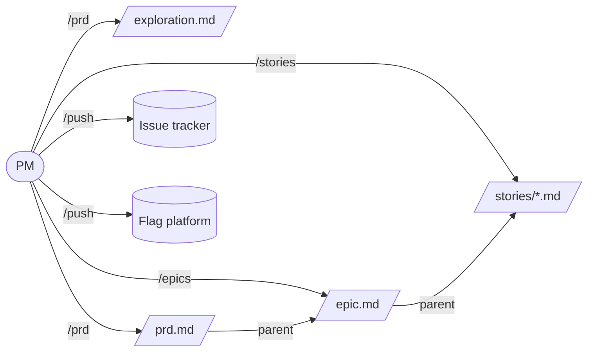

# prdspec

A Claude Code plugin implementing the Requirements Management Framework: PM exploration → Pitch (PRD) → Epics → User Stories → issue tracker, optimized for AI-agent-driven delivery and Product-Led Growth.

The framework specification lives in [`requirements-framework.md`](./requirements-framework.md). The implementation strategy lives in [`prd-tool-handoff.md`](./prd-tool-handoff.md). The phased build plan lives in [`implementation-plan.md`](./implementation-plan.md).

## What you get

Four user-invoked slash commands, one shared knowledge skill:

| Command | Phase it owns | Writes to |
|---|---|---|
| `/prd` | PRD synthesis from PM exploration | `{NNN}-{slug}/prd.md` (and `exploration.md` snapshot) |
| `/epics` | Epic shaping (explore vs. direct mode) | `{NNN}-{slug}/{epic-slug}/epic.md` |
| `/stories` | Story decomposition with implementer context | `{NNN}-{slug}/{epic-slug}/stories/{story-slug}.md` |
| `/push` | Mirror Epic + Stories to issue tracker | Whichever tracker the host's `AGENTS.md` declares (Jira / Linear / GitHub Projects / …) — writes tracker IDs back to frontmatter |

The shared `prdspec` skill carries templates, conventions, and the verb→tool binding (`tools.md`). The runbooks are tool-agnostic — when an MCP-backed implementation ships, only `tools.md` changes.

## Install

This plugin ships in the [`krmrn-skills`](../../) marketplace. Inside Claude Code:

```text
/plugin marketplace add krmrn42/krmrn-skills
/plugin install prdspec@krmrn-skills
```

## Use

In a host project (the codebase whose features you're scoping):

1. **Declare standing stores.** Drop an `AGENTS.md` at the project root listing where the framework's data sources live (tracker, flag platform, code paths, evidence stores, ADRs, etc.). See [`examples/AGENTS.md`](./examples/AGENTS.md) for the full schema; mark anything inapplicable as `none` rather than omitting.
2. **Run `/prd <slug>`** with your exploration as context (paste it, attach a file, or run from a chat that already contains it). The runbook snapshots exploration to `{NNN}-{slug}/exploration.md`, drafts the PRD, surfaces `[GAP: ...]` markers, and asks the 3–5 highest-leverage questions before drafting dependent sections.
3. **Approve.** Move `Status: Draft` to `Status: Approved` in the PRD frontmatter once you're satisfied. The PM is the sole mover of Status — the runbooks never change it.
4. **Run `/epics ./{NNN}-{slug}/prd.md`.** Default mode proposes 2–3 distinct slicing strategies (who-ships-first / what-de-risks-first / what-monetizes-first) and lets you pick. Direct mode (`/epics <prd-path> <epic-name>`) expands a named epic.
5. **Approve epics**, then **`/stories ./{NNN}-{slug}/{epic-slug}/epic.md`** for each. The runbook walks the parent chain, runs ripgrep over your `code:` paths to populate Implementer Context, and pins curated project knowledge per story.
6. **Approve stories**, then **`/push ./{NNN}-{slug}/{epic-slug}/epic.md`** to mirror Epic + Stories to whichever tracker your `AGENTS.md` declares. The runbook is pure transport — never modifies requirements; surfaces field mismatches instead. Registers the Epic flag against the declared flag platform (with the required runbook + kill-switch test + cleanup ticket triad). Writes Tracker IDs back into frontmatter.

## Architecture at a glance



The four runbooks read upstream artifacts via the `parent:` chain, search standing stores declared in `AGENTS.md`, and write artifacts as Markdown. The shape is intentionally simple — the framework's discipline lives in the runbook prose, not in code.

## Plugin layout

```
plugins/prdspec/
├── .claude-plugin/plugin.json
├── README.md                            # this file
├── requirements-framework.md            # framework specification
├── prd-tool-handoff.md                  # implementation strategy
├── implementation-plan.md               # phased build plan
├── examples/AGENTS.md                   # host-project sample (Jira / Linear / GitHub Projects)
├── future-work/                         # parked-ideas registry
├── commands/                            # /prd, /epics, /stories, /push
└── skills/prdspec/
    ├── SKILL.md
    ├── tools.md                         # verb → tool binding (MCP migration seam)
    ├── conventions/                     # frontmatter, gap-protocol, no-fabrication, …
    └── templates/                       # PRD / Epic / Story (verbatim from framework)
```

## Status

**v1** — filesystem backend, tracker-agnostic `/push` (the host's `AGENTS.md` declares the tracker; the agent reads it and acts), manual pilot is the test. MCP migration path is the design centerpiece: only [`skills/prdspec/tools.md`](./skills/prdspec/tools.md) changes when an MCP backend ships. See [`prd-tool-handoff.md`](./prd-tool-handoff.md) § "Tool abstraction pattern" and [`skills/prdspec/tools.md`](./skills/prdspec/tools.md) § "Migration path".

Future work (parked ideas, not in v1) lives in [`future-work/`](./future-work/) — including the workflow for managing that registry, server-enforced approved-section immutability, and richer anchor verification.

## License

MIT
