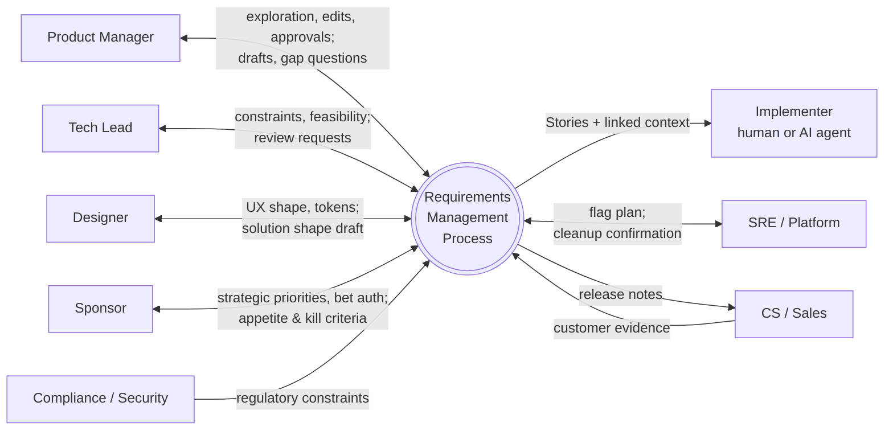
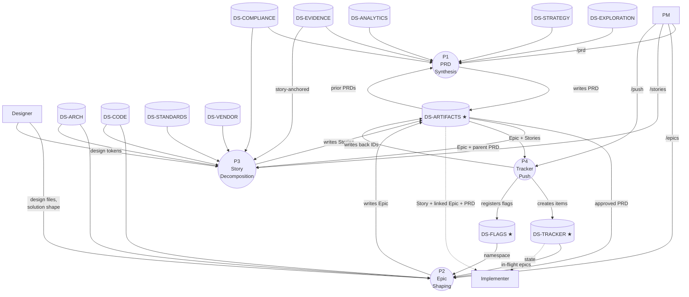

# Requirements Management Framework
**Post-discovery → Pitch (PRD) → Epics → User Stories → Issue Tracker**
**Optimized for AI-agent-driven development and Product-Led Growth.**

---

## Design principles

The framework starts where product exploration ends — the moment a PM has enough conviction to commit to *something*, but before delivery begins. It is opinionated about four things:

**1. Each agent run is fresh.** Every process step is designed to run as an agent invocation with *no prior chat history* — only the previous artifacts plus the standing knowledge stores. This forces every artifact to be self-sufficient for the next step in the pipeline. The artifact carries forward what's still relevant and adds what's newly relevant. Tribal knowledge, partial context, and "you had to be in the call" details are not allowed to leak between steps. This single constraint determines almost everything else in the framework.

**2. Structure replaces seniority.** Shape Up assumes the Pitch author is a senior leader with internalized context. We do not. Each document leads the author title-by-title through a fixed sequence of slots. Empty slots are visible, which forces the author (or the subagent) to either fill them or explicitly mark them N/A. Gaps cannot hide.

**3. Bet > backlog, with a documented bet.** We keep Shape Up's most useful idea — frame work as a *bet* with a fixed *appetite* and explicit *no-gos* — and drop the parts that fight the AI era (the Betting Table, time-boxed shaping cycles, the assumption that estimation is the enemy). The "venture capital" framing lives in the PRD's `Bet & Appetite` and `Kill criteria` sections.

**4. Flag-native rollout.** Every Epic and Story carries a feature flag plan. The flag is part of the contract, not a delivery afterthought. This makes the bet *reversible* and gives PLG teams the surface they need for cohort experiments.

A note on the "Goldilocks Spec" challenge: our resolution is to push *what* and *why* up to the PRD, *what ships and how it's gated* to the Epic, and *implementation context* down to the Story. Each layer has one job.

---

## System model

Before defining templates, we define the system the templates serve. The framework is one process that consumes PM exploration and emits tracker items, while reading from the project's standing knowledge stores. We define stakeholders, knowledge stores, and the data flows between them — then derive what each artifact must contain so any process step can run as a fresh agent invocation.

### Stakeholders

| Stakeholder | Role | Touchpoints |
|---|---|---|
| **Product Manager** | DRI of the requirements process. Initiates each stage; reviews and edits all artifacts. Sole approver for status changes. | Authors exploration; invokes `/prd`, `/epics`, `/stories`, `/push`; edits artifacts. |
| **Tech Lead** | Reviews technical feasibility; supplies constraints; verifies Implementer Context accuracy before Story handoff. | Reviews PRD §7 Constraints, Epic §5 Done criteria, Story §4 Implementer Context. |
| **Designer** | Owns Solution Shape coherence; supplies design tokens and accessibility floor. | Reviews PRD §8; contributes to Epic-level UX direction. |
| **Sponsor / Stakeholder** | Authorizes the bet and the appetite. | Reviews PRD §4 Bet & Appetite and §5 Outcomes. |
| **Compliance / Legal / Security** | Supplies regulatory constraints; reviews compliance posture. | Inputs to PRD §7; verifies Epic §5 security criteria. |
| **Implementer** (human or AI agent) | Consumes Stories. Requires the Story to be self-sufficient given the linked Epic, PRD, and standing stores. | Reads Story; opens linked artifacts; runs against codebase. |
| **SRE / Platform** | Owns flag lifecycle and kill-switch readiness. | Reviews Epic §6 Feature flag plan; signs off on cleanup. |
| **Customer Success / Sales** | Source of evidence; downstream consumer of release notes. | Provides DS-EVIDENCE input; receives Epic §1 release notes. |
| **AI subagents** (`/prd`, `/epics`, `/stories`, `/push`) | Orchestrators. Each is invoked fresh per step; no inherited chat state assumed. | Read upstream artifacts and standing stores; write next artifact. |

### Knowledge stores

The framework reads from twelve stores. Three are owned and written by the framework; nine are external and read-only from the framework's perspective.

| ID | Store | Owner | Content | Refresh | Access |
|---|---|---|---|---|---|
| DS-EXPLORATION | PM Exploration | PM | Per-initiative chat, notes, raw research. The thing the PM hands to `/prd`. | Per initiative | Chat thread, file, or Notion page |
| DS-STRATEGY | Strategy & Roadmap | Leadership | OKRs, themes, north-star metric, positioning | Quarterly | Notion / Confluence |
| DS-EVIDENCE | Customer Evidence | CS / Sales / Research | Call recordings, transcripts, tickets, NPS, surveys, replays | Continuous | Gong, Zendesk, etc. |
| DS-ANALYTICS | Product Analytics | Data | Cohorts, funnels, dashboards, telemetry | Continuous | Mixpanel / Amplitude / internal |
| DS-ARCH | Architecture KB | Tech leads | ADRs, system diagrams, capability maps, interface contracts | Per decision | In-repo `/docs` or wiki |
| DS-CODE | Codebase | Engineering | Indexed source repos | Continuous | Ripgrep + semantic indexer |
| DS-STANDARDS | Project Standards | Eng + Design | `AGENTS.md`, `CLAUDE.md`, coding standards, design tokens, runbook templates | As needed | In-repo |
| DS-COMPLIANCE | Compliance Library | Security / Legal | SOC 2 controls, HIPAA, GDPR, PCI scope mappings | Per audit | GRC tool or Notion |
| DS-VENDOR | Vendor Documentation | Tech leads (per integration) | Third-party API references, SLAs, snapshots | As upstream changes | Vendor sites + cache |
| DS-ARTIFACTS ★ | Requirements Artifacts | This framework | PRDs, Epics, Stories (active + archived) | Per `/prd`, `/epics`, `/stories` | File system + VCS |
| DS-TRACKER ★ | Issue Tracker | PM + Eng | Linear / Jira / GitHub items, state, history | Continuous | API |
| DS-FLAGS ★ | Feature Flag Registry | Platform | Flag names, states, owners, cleanup tickets | Per release | Flag platform API + in-repo config |

★ = framework writes to this store.

A note on DS-EXPLORATION: this is intentionally promoted to a first-class store rather than treated as transient chat. The PM may invoke `/prd` multiple times against the same exploration as new evidence arrives, and the same exploration may seed PRDs in adjacent areas. Persisting it as a sibling of the PRD inside the initiative directory (see Workspace structure below) prevents loss of context between exploration and downstream stages.

### Context diagram



### DFD Level 0

The framework decomposes into four processes. Each process is invocable as a fresh agent run with no prior chat history; the standing stores plus the linked upstream artifact are sufficient input.



### Per-process knowledge requirements

For each process, given a fresh agent run, what must be available? The third column is the implication for the *upstream* artifact — what links it must contain so the next process can run cold.

#### P1 — PRD Synthesis

| Aspect | Detail |
|---|---|
| Loaded on invocation | DS-EXPLORATION (or existing PRD draft for refinement runs) |
| Standing-store context | Strategic anchor from DS-STRATEGY · evidence anchors from DS-EVIDENCE · analytics anchors from DS-ANALYTICS · compliance constraints from DS-COMPLIANCE · prior PRDs from DS-ARTIFACTS for relationship/collision checks |
| Implication for upstream artifact | DS-EXPLORATION must be persisted as a stable reference, not transient chat. The `/prd` subagent's first action is to snapshot exploration into the initiative directory so subsequent runs and downstream agents can re-resolve it. |

#### P2 — Epic Shaping

| Aspect | Detail |
|---|---|
| Loaded on invocation | The approved PRD (DS-ARTIFACTS) |
| Standing-store context | Architecture from DS-ARCH (boundaries that inform slicing) · codebase shape from DS-CODE (services, modules) · active epics from DS-TRACKER + DS-ARTIFACTS (avoid conflicts) · flag namespace from DS-FLAGS |
| Implication for PRD | PRD must contain: strategic anchor, evidence anchors, analytics anchors, compliance constraints, prior-art links — each with explicit *why-it-matters*. Solution Shape must be specific enough that an Epic-shaping agent can identify candidate slicing axes (who/what/when ships first). |

#### P3 — Story Decomposition

| Aspect | Detail |
|---|---|
| Loaded on invocation | The Epic (DS-ARTIFACTS), which links its parent PRD |
| Standing-store context | Deep code search via DS-CODE · project standards from DS-STANDARDS (patterns, design tokens, runbooks) · ADRs from DS-ARCH · vendor docs from DS-VENDOR (per integration) · specific controls from DS-COMPLIANCE · story-anchored evidence from DS-EVIDENCE |
| Implication for Epic | Epic must contain: architecture anchors (ADR refs with why), code-surface map (services touched), flag namespace allocation, in-flight context (related active epics), and *inherited PRD section pointers* — naming which PRD outcomes / constraints / non-goals apply specifically here, rather than a blanket "see parent." |

#### P4 — Tracker Push

| Aspect | Detail |
|---|---|
| Loaded on invocation | Epic + Stories (DS-ARTIFACTS) |
| Standing-store context | Tracker schema from DS-TRACKER · flag conventions from DS-FLAGS |
| Implication for Epic + Stories | Stories must contain everything an implementer needs to start work: Implementer Context with code-level pointers, Project-knowledge anchors with why-it-matters, vendor doc references per integration, specific compliance controls (narrowed from PRD-level), and inherited Epic + PRD pointers. |

#### Recurring rule

Every link in every artifact carries a *why-it-matters* annotation in 1–2 lines. A URL without rationale fails the freshness test — a fresh agent reading the artifact cannot tell whether to follow the link or how to use what it finds.

### Implications for artifact structure

The analysis above produces specific anchor sections that must appear in each artifact. Templates below are derived from this analysis.

| Artifact | Anchor sections derived from the DFD |
|---|---|
| **Exploration Snapshot** *(stored at `{NNN}-{slug}/exploration.md`)* | Persisted exploration that fed P1; PRD points back to it as a sibling. |
| **PRD** | Exploration · Strategic · Evidence · Analytics · Compliance · Prior art |
| **Epic** | Inherited PRD section pointers · Architecture · Code-surface · In-flight context · Flag namespace |
| **Story** | Inherited Epic + PRD pointers · Story-anchored evidence · Implementer code context · Project-knowledge · Vendor docs · Specific compliance controls |

Two distinct kinds of pointers appear in artifacts and must not be confused: **inherited pointers** travel *up* the chain to parent artifacts that bind the current one; **anchors** travel *out* to standing knowledge stores. A child artifact uses inherited pointers to declare "what already-decided context applies to me," and uses anchors to declare "what external knowledge applies to me."

---

## Workflow

The four processes:

1. **P1 — `/prd`.** Allocate the next initiative number, create `{NNN}-{slug}/` at the workspace root, snapshot the exploration to `exploration.md`, then synthesize the PRD into `prd.md`. The subagent reads the chat (first run) or the existing PRD (refinement), populates anchor sections via search against DS-STRATEGY / DS-EVIDENCE / DS-ANALYTICS / DS-COMPLIANCE / DS-ARTIFACTS, surfaces `[GAP: ...]` markers, and asks 3–5 highest-leverage questions before drafting.

2. **P2 — `/epics {prd}`.** Two modes:
   - *Explore* (default): the subagent proposes 2–3 distinct slicing strategies that differ on a real axis — *who ships first*, *what de-risks first*, *what monetizes first*. The PM picks one or asks for another round.
   - *Direct* (PM names an epic): expand the named epic, calling out what gets deferred to siblings or future epics.

   In both modes the agent populates inherited PRD pointers and Epic anchors via search against DS-ARCH / DS-CODE / DS-TRACKER / DS-FLAGS.

3. **P3 — `/stories {epic}`.** Decompose the epic into stories. The agent runs ripgrep over DS-CODE to fill Implementer Context and surfaces project-knowledge anchors from DS-STANDARDS / DS-ARCH / DS-VENDOR / DS-COMPLIANCE — pinning the curated subset that applies to this specific story so it isn't re-discovered at implementation time.

4. **P4 — `/push {epic}`.** Mirror Epic + Stories into the tracker, register flags in DS-FLAGS, write tracker IDs back into the markdown frontmatter. Pure transport — never modifies requirements.

**Iteration rule.** Every subagent re-reads its target file and produces a clean diff. Sections marked `Approved` in frontmatter are immutable for that run. PM edits between runs are preserved.

### Workspace directory structure

The directory layout is **slug-driven, with numeric prefixing at the initiative level** for chronological ordering. Inside an initiative the counts are small enough that slugs alone are unambiguous.

```
./
├── 001-semantic-search/
│   ├── exploration.md
│   ├── prd.md
│   ├── jira-connector/
│   │   ├── epic.md
│   │   └── stories/
│   │       ├── oauth-flow.md
│   │       ├── search-endpoint.md
│   │       └── result-ranking.md
│   └── confluence-connector/
│       ├── epic.md
│       └── stories/
│           └── page-crawl.md
├── 002-agent-marketplace-billing/
│   └── ...
└── archive/
    └── 000-feature-flag-platform/
        └── ...
```

**Conventions:**

- **Active initiatives sit at the workspace root** as `{NNN}-{initiative-slug}` directories (e.g., `001-semantic-search`). Three digits accommodates ~1000 initiatives; if outgrown, a one-time pad to four digits.
- **Archived initiatives move to `archive/`** as one operation when the PRD reaches `Archived` status; the initiative directory keeps its number. The archive boundary is the only lifecycle directory — finer-grained status is a frontmatter field on each artifact.
- **Numbering reflects entry sequence, not priority.** Renumbering breaks parent-chain links and git history — do not renumber. New initiatives take the next number even if they logically slot earlier.
- **Each epic is a directory** named for its slug. Inside it, `epic.md` is the epic document and `stories/` contains the epic's stories. This co-locates an epic with its stories while leaving room for additional artifact types (e.g., `plan.md`, `decisions/`, `design/`) to be introduced later without colliding with the story namespace.
- **Story files are flat** under `stories/`: `{story-slug}.md`. Stories have no children, so no further nesting. **No order is encoded in filenames** — listings are alphabetical by slug, hard dependencies are expressed via the Story's `Depends on:` frontmatter field, and implementation sequencing lives in the issue tracker.
- **Positive-identification rule for artifact types.** Each artifact type has a dedicated location: PRD at `prd.md`, exploration at `exploration.md`, epic at `epic.md`, stories under `stories/`. New artifact types added in the future get their own dedicated location (e.g., a future `plan.md` or `decisions/` directory). The framework never relies on negation rules like "anything not named X is a Y" — that keeps the layout open to extension.
- **Path form for parent links.** Frontmatter `parent:` fields and inline references use paths relative to the artifact's location: from the PRD, `./exploration.md`; from an Epic, `../prd.md`; from a Story, `../epic.md` and `../../prd.md`. Subagents resolve these literally.

**Status semantics.** The PM is the sole mover of the `Status` field. `Approved` means PM has confirmed the artifact is ready for the next stage; sponsor and tech-lead reviews happen as edits and comments before the PM moves the field. There is no separate sign-off ritual — VCS history is the audit trail.

**Parent-chain loading.** Subagents follow `parent` fields in frontmatter to load upstream artifacts. `/stories` loads its Epic, then loads the Epic's parent PRD; `/epics` loads its PRD, which links its exploration snapshot. No subagent assumes anything beyond what links resolve to.

**Universal subagent disciplines.** Two rules apply to all four subagents:
- **Gap protocol.** When a slot can't be filled with confidence, surface as `[GAP: ...]` rather than fabricating, then ask the 3–5 highest-leverage clarifying questions before drafting the dependent slots.
- **No-fabrication.** If an anchor cannot be verified against an actual store, surface as `[GAP: anchor unverified]` rather than inventing a plausible-looking link.

---

## Template 1 — Pitch (PRD)

```markdown
# Pitch: {Concise capability name}

> **Status:** Draft | In review | Approved | Active | Shipped | Archived
> **DRI:** @owner
> **Created:** YYYY-MM-DD · **Last updated:** YYYY-MM-DD
> **Slug:** kebab-case-slug-used-for-flags
> **Initiative dir:** {NNN}-{slug}/
> **Exploration:** ./exploration.md *(sibling)*
> **Strategic parent:** [link to OKR or roadmap theme]

---

## 1. Problem
> *What is broken or missing, for whom, right now? One paragraph. Specific user, specific pain. No solutions yet.*

[paragraph]

## 2. Evidence
> *Qualitative signal that this problem is real. Each bullet ties to an anchor in §13.*

- [observation] — *anchor: §13 Evidence #1*
- ...

## 3. Why now
> *What changed that makes this the right moment? Market shift, technology unlock, customer pull, internal capability, regulatory pressure. If "why now" is weak, the bet is weak.*

[paragraph]

## 4. Bet & Appetite
> *The hypothesis we're testing and the budget we're willing to spend before re-evaluating.*

**Hypothesis:** If we ship {X}, we expect {measurable outcome Y} within {timeframe} because {causal mechanism Z}.

**Appetite:** {Small ~2 weeks · Medium ~6 weeks · Large ~quarter}

**Kill criteria:** At the **end of the appetite window** (or earlier if any criterion is observed), we stop and reassess if any of the following is true:
- [criterion 1, observable]
- [criterion 2, observable]

## 5. Outcomes
> *1–3 outcomes. Each measurable. Pair leading and lagging indicators. Cite analytics anchors where the indicator is defined.*

| # | Outcome | Leading indicator (anchor) | Lagging indicator (anchor) |
|---|---|---|---|
| 1 | ... | ... — *§13 Analytics #1* | ... — *§13 Analytics #2* |

## 6. Non-goals
> *What we will NOT do, even though tempting. Specific — name features, integrations, edge cases. The most under-written PRD section and the one that prevents most scope creep.*

- We will not {specific thing}.
- ...

## 7. Constraints
> *Hard boundaries that shape the solution space. Inputs to design, not aspirations. Compliance constraints cite specific anchors in §13.*

**Technical:** [stack, integration points, latency budgets, data residency]
**Compliance & security:** [specific controls — e.g., "SOC 2 CC6.1 — see §13 Compliance #1"]
**AI governance** *(if any AI/ML component):* autonomy level (suggest / confirm / autonomous), explainability tier, human-in-the-loop checkpoints, data sensitivity. Mark **N/A** if no AI component.
**Performance / scale:** [throughput, p95/p99, concurrency]
**Budget / time:** [appetite per §4; add headcount or vendor budget]
**Brand / UX:** [voice, accessibility floor, supported locales]

## 8. Solution shape
> *The "fat marker sketch" — rough but committal. Names the surfaces involved, the data flow, the user-visible affordances. Does NOT specify pixels, copy, or function signatures. 2–4 paragraphs or an annotated diagram. Must be specific enough that an Epic-shaping agent can identify candidate slicing axes.*

[shape]

## 9. PLG mechanics
> *How users discover, activate, and expand value. If sales-led only, mark sections N/A explicitly — don't omit them.*

**Discovery:** How does a prospective user find this capability? (SEO surface, in-product nudge, viral artifact, agent-readable docs)

**Activation — the aha moment:** What single observable event means "this user got it"? Target time-to-aha: {seconds/minutes}. The 2026 PLG benchmark for first-session aha is under 60 seconds for AI-native products.

**Expansion loop:** What user action makes the next user (seat, workspace) more likely?

**Friction inventory:** Blockers to self-serve activation; for each: remove, defer, or accept.

**Agent-readability:** Can an external AI agent operate this capability via API and structured docs? If no, what's the gap?

## 10. Rollout strategy
> *Every PRD ships behind a top-level flag.*

**Top-level flag:** `{product}.{slug}` — e.g., `shift.semantic_search`

**Phases:**
| Phase | Audience | Entry criteria | Exit criteria |
|---|---|---|---|
| Dark launch | Internal staff | Code merged, telemetry wired | No P0/P1 over 3 days |
| Beta cohort | Named design partners | Onboarding doc, support trained | Activation ≥ X%, NPS ≥ Y |
| GA opt-in | All users, toggle | Beta exit met | Adoption ≥ Z% |
| GA default | All users, on by default | GA opt-in adoption sustained 2 weeks | — |
| Cleanup | — | GA-default 4 weeks, no rollbacks | Flag removed from code |

**Kill switch:** Top-level flag flips off without a deploy. Runbook: [link]. Customer comms template: [link].

## 11. Risks & rabbit holes
> *What could derail this. For each: describe + decide (mitigate / accept / monitor).*

- **Risk:** ... · **Decision:** mitigate by ...
- ...

## 12. Open questions
> *Things we don't know yet, blocking Epic shaping. Tag with @owner.*

- [ ] [question] — @owner

## 13. Anchors
> *Structured links to standing knowledge stores. Every anchor includes WHY it matters in 1–2 lines. The fresh-agent test: a `/epics` agent loading this PRD should be able to use each anchor without further explanation.*

### Exploration
- [./exploration.md](./exploration.md) — *Sibling snapshot of the PM exploration that seeded this PRD; covers customer interviews W14–W17 and competitive teardown.*

### Strategic
- [OKR Q3 2026: "Reduce time-to-first-agent below 5 minutes"](url) — *§5 Outcome 1 directly contributes to this OKR; this PRD is the primary path-to-target.*

### Evidence
- [Customer call: Acme Corp, 2026-04-12](url) — *Source for the activation friction in §1; quote at 14:30 anchors the "we gave up on the second sandbox" claim.*
- [Support ticket cluster #2412–#2467](url) — *57 tickets across 6 weeks all stem from the failure mode in §1.*
- ...

### Analytics
- [Mixpanel cohort: trial signups by aha completion](url) — *Defines the activation event used in §5 indicators; cohort with aha < 60s retains 3.2× better.*
- ...

### Compliance
- [SOC 2 CC6.1 — Logical access controls](url) — *Binds §7; any new agent surface must enforce role checks at the API gateway.*
- ...

### Prior art
- [PRD: agent-runtime sandboxing v1, 2025-Q4](url) — *Predecessor; we extend its sandbox boundary. §8 Solution shape assumes its primitives.*
- ...

### Other references
- [link] — *why*
```

---

## Template 2 — Epic

```markdown
# Epic: {Saleable increment name}

> **Status:** Draft | Ready | In progress | In rollout | GA | Done
> **Parent PRD:** ../prd.md
> **DRI:** @owner · **Tech lead:** @owner · **Designer:** @owner
> **Tracker ID:** [link to Linear/Jira epic]
> **Slug:** kebab-case
> **Target rollout window:** YYYY-MM — YYYY-MM

---

## 1. What ships
> *Press-release test: write a one-line release note for the moment this epic exits its flag. If you can't, the increment isn't saleable yet.*

**Release note:** "{One sentence describing user-visible value.}"

[1–2 paragraphs of context for someone who won't read the PRD]

## 2. Inherits from PRD
> *Explicit pointers to which PRD sections bind this epic. Not a blanket "see parent" — name the specific items so a fresh /stories agent loading just this Epic + the PRD can scope correctly.*

- **Outcome served (PRD §5):** Outcome #{N} — "{outcome name}". This epic delivers {fraction or specific contribution — e.g., "the data ingestion half; search UI ships in Epic-2"}.
- **Constraints that bind (PRD §7):** {list specific constraint lines, e.g., "p95 latency < 200ms; SOC 2 CC6.1; supports on-prem deployment"}
- **Non-goals reaffirmed (PRD §6):** {non-goals from PRD that are particularly tempting to violate inside this epic}
- **Bet & kill criteria (PRD §4):** {restate the hypothesis fragment this epic tests; restate the kill criteria that apply at this epic's checkpoint}

## 3. User journeys included
> *Each becomes one or more User Stories. List the journey, not the implementation.*

- **J1:** {persona} {goal} → {outcome}. Story candidates: {short list}
- **J2:** ...

## 4. Solution shape (this epic)
> *The slice of PRD §8 Solution shape that applies here. If this epic introduces shape decisions not in the PRD, name them explicitly so they can be reviewed. Pin design files (Figma, prototypes, flows) here — this is the design hand-off point into Story decomposition.*

[shape]

**Design artifacts:**
- [Figma: {epic name} flows](url) — *Primary UX source for stories under this epic; tokens follow design system.*
- ...

## 5. Done criteria
> *Observable conditions for this epic to GA-default. Functional, non-functional, telemetry, ops.*

- **Functional:** [what must work]
- **Performance:** [latency / throughput / error budgets]
- **Security & compliance:** [audit log entries, data classification, access controls]
- **Telemetry:** [events emitted, dashboards live, alerts configured]
- **Documentation:** [user-facing, agent-readable API, internal runbook]

## 6. Feature flag plan
> *Every epic has its own flag. Stories inherit it. Sub-flags only when a story needs independent rollout.*

**Flag name:** `{prd_slug}.{epic_slug}` — e.g., `shift.semantic_search.jira_connector`
**Default:** off
**Owner of flag lifecycle:** @owner
**Cleanup ticket:** [link — must exist before merge to main]
**Per-phase entry criteria:** inherits PRD §10; override here only if this epic ships on a different cadence
**Kill switch behavior:** when flag flips off, {describe user-visible behavior — graceful degradation, fallback, error}; verified by test {test name/path}.

## 7. Dependencies
> *What must exist before this epic can ship.*

- **Blocking us:** [other epics, infra work, third-party API, design system component]
- **Blocked by us:** [what we'll deliver to others]
- **External:** [vendors, legal review, security review]

## 8. Out of scope
> *Items explicitly deferred. Cite the epic or PRD section that owns the deferred work.*

- {item} — deferred to [Epic Y] / [Backlog] / [out of scope of this PRD]

## 9. Telemetry & success metrics
> *Defined here so they're built in, not added after launch.*

**Events:** [event_name, payload shape, where fired]
**Dashboards:** [link or "to be built; ticket {ID}"]
**Success thresholds:** [activation %, error rate, p95 latency, support ticket volume]
**Review cadence:** [weekly during beta, monthly after GA]

## 10. Anchors

### Architecture
- [ADR-0042: agent-runtime sandbox boundaries](url) — *§4 Solution shape sits on top of this; "no synchronous host calls" is a hard constraint passed to all stories under this epic.*
- [System diagram: ingestion pipeline](url) — *Names the components stories will touch.*
- ...

### Code-surface map
> *Services this epic touches at high level. Deep code refs go in each story.*

- `services/ingestion-api` — entry points for new connectors
- `services/index-worker` — embedding + write path
- `web/portal/app/search` — UI surfaces

### In-flight context
- [Epic: marketplace billing v2](url) — *Active; shares the auth gateway. Coordinate with @owner before §6 flag promotion to avoid auth-flag conflict.*
- ...

### Flag namespace
- This epic owns `{prd_slug}.{epic_slug}.*`. Sub-flags must be registered in DS-FLAGS before merge.

### Other references
- [link] — *why*
```

---

## Template 3 — User Story

```markdown
# Story: {User-perspective outcome}

> **Status:** Draft | Ready | In progress | In review | Done
> **Parent epic:** ../epic.md
> **Parent PRD:** ../../prd.md *(transitive — repeated for fresh-load convenience)*
> **DRI:** @owner · **Implementer:** @human-or-agent
> **Tracker ID:** [link]
> **Slug:** kebab-case
> **Depends on:** {sibling-story-slug, ...} *(optional; sibling slugs only — captures hard requirements-side dependencies, not implementation sequencing)*
> **Estimated size:** XS | S | M | L *(sequencing only, not commitment)*

---

## 1. User statement
> *Standard form. The "so that" clause is the appeal to the parent epic.*

As a **{persona}**, I want **{capability}** so that **{outcome that maps to a journey in the parent epic}**.

## 2. Inherits from Epic
> *Explicit pointers to the Epic items this story serves and binds to. A fresh implementer loading just this Story should know which parent context applies without rereading the whole Epic.*

- **Journey served (Epic §3):** J{N} — "{journey title}"
- **Done-criteria contribution (Epic §5):** {which functional / performance / security / telemetry items this story moves toward}
- **Flag inherited (Epic §6):** `{epic flag}` — see §8 below for wiring
- **Constraints inherited (PRD §7):** {specific lines that apply to this story — e.g., "p95 < 200ms applies to the new search endpoint"}

## 3. Story-anchored evidence
> *Required when the parent Epic's journey ties to specific evidence in PRD §13; mark **N/A** otherwise. The specific customer voice this story serves. Closes the loop from PRD evidence to a concrete user need at implementation time, useful for the implementer's judgment on edge cases.*

- [Customer quote / clip: Acme Corp, 2026-04-12 @ 14:30](url) — *"We gave up on the second sandbox" — the specific friction this story removes.*

## 4. Implementer context
> *Story-specific pointers that narrow the implementer to the right corner of the codebase. Filled by the /stories subagent via code search; updated before handoff if anything has shifted. Complements project-wide knowledge available through skills, AGENTS.md, indexed internal docs, and MCP servers.*

**Repos / paths:**
- `{repo}/{path/to/relevant/module}` — {what lives here}
- `{repo}/{path/to/tests}` — {fixture and test patterns to follow}

**Patterns to follow:**
- {convention 1, with file ref} — e.g., "All new endpoints use the `withAuth(handler)` wrapper; see `api/agents/[id]/route.ts:14`."
- ...

**Data models touched:**
- `{Model}` — {fields read/written}

**Existing tests to extend:**
- `{path/to/test.ts}` — {how}

**Things the implementer should NOT do:**
- {anti-pattern, with reason}

## 5. Acceptance criteria
> *Given/When/Then. Each individually verifiable. If a criterion can't become a test, rewrite it.*

- **AC1:** Given {state}, when {action}, then {observable result}.
- ...

## 6. Edge cases & error states

| Case | Expected behavior |
|---|---|
| {network failure mid-action} | {graceful retry / error toast} |
| {empty input} | ... |
| {permission denied} | ... |

## 7. Definition of Done
> *Universal checklist. Append project-specific items.*

- [ ] All acceptance criteria pass automated tests
- [ ] Feature flag check is in place at the entry point(s); off-state behavior matches §8 spec, verified by test
- [ ] Telemetry events emitted as specified in Epic §9
- [ ] Error paths produce structured logs with correlation IDs
- [ ] Accessibility: keyboard nav, ARIA labels, contrast meets WCAG AA
- [ ] Performance: meets Epic §5 budget under load test
- [ ] Docs updated: user-facing copy, agent-readable API spec
- [ ] PR description references this story and parent epic
- [ ] No new flag without a paired cleanup ticket

## 8. Feature flag wiring
> *Where the flag check goes. Specific. An AI agent should insert it without guessing.*

**Inherits flag:** `{epic flag}` — from Epic §6
**Sub-flag (if any):** `{epic flag}.{story slug}` — *only if this story needs to ship independently within the epic*

**Check locations:**
- `{file:line}` — entry point of the new code path
- `{file:line}` — UI rendering guard

**Off-state behavior:** {what users see / what the API returns when the flag is off — not just "hidden"; specify}

## 9. Out of scope
> *Items deferred to other stories within this epic, or to a future epic.*

- {item} — handled by Story {ID} / deferred

## 10. Anchors

### Project knowledge
> *Curated subset of standing knowledge that bears specifically on this story. Pinned during /stories decomposition so the implementer doesn't re-discover it. The implementer still has access to project-wide knowledge via skills, AGENTS.md, etc. — these are the entries we already know apply.*

- [ADR-0042: agent-runtime sandbox boundaries](url) — *This story crosses the sandbox at §5 AC2; the "no synchronous host calls" rule constrains the implementation.*
- [Runbook: Qdrant index rebuild](url) — *Touched if the schema change in AC3 lands; rebuild must run before flag promotion.*
- [Design tokens: status indicators](url) — *Use `status.warning` token, not a hardcoded color, for the deferred-state badge in AC4.*

### Vendor docs
- [Jira REST API: search endpoints](url) — *AC1 calls `POST /rest/api/3/search/jql`; rate-limit headers must be honored per §6.*

### Compliance controls (specific)
- [SOC 2 CC6.1 — Logical access controls](url) — *Inherited from PRD §7; this story's new endpoint must enforce role checks at the gateway.*

### Other references
- [link] — *why*
```

---

## Feature flag conventions

**Naming:** `{prd_slug}.{epic_slug}[.{story_slug}]`. Lowercase, dot-separated, no spaces. Example: `shift.semantic_search.jira_connector`.

**Lifecycle states:** `off` → `dev` → `internal` → `beta` → `ga_opt_in` → `ga_default` → `cleanup` → `removed`.

**Required at flag creation:** runbook entry, kill-switch test, paired cleanup ticket.

**Cleanup discipline:** A flag at `ga_default` for ≥ 4 weeks with no rollbacks moves to `cleanup` automatically. Prevents the slow accumulation of dead flags.

**Sub-flags are the exception.** If every story under an epic gets its own sub-flag, the epic is too large; re-slice it.

---

## Subagent design notes

**`/prd`** — System prompt knows the PRD template by heart. On invocation: allocate the next initiative number, create the initiative directory `{NNN}-{slug}/` at the workspace root, snapshot exploration to `exploration.md` inside it, then synthesize `prd.md` alongside; read prior chat (or existing PRD draft); populate §13 anchors via search against DS-STRATEGY / DS-EVIDENCE / DS-ANALYTICS / DS-COMPLIANCE / DS-ARTIFACTS; draft §1/3/4; surface gaps as `[GAP: ...]`; ask 3–5 highest-leverage questions before drafting §5/6/7.

**`/epics`** — Two modes (explore vs. direct). In explore mode, generate strategies that differ on a real axis: *who ships first*, *what de-risks first*, *what monetizes first*. Avoid producing three variants of the same slicing. In both modes, populate §2 inherited PRD pointers explicitly (do not let "see parent" stand) and populate §10 anchors via search against DS-ARCH / DS-CODE / DS-TRACKER / DS-FLAGS.

**`/stories`** — Most engineering-coupled subagent. Runs ripgrep over DS-CODE to populate Implementer Context §4. Surfaces project-knowledge anchors from DS-STANDARDS / DS-ARCH / DS-VENDOR / DS-COMPLIANCE — pinning the curated subset that applies to this specific story so it isn't re-discovered at implementation time. The story is not the right place to re-document architecture; it's the right place to pin the *applicable subset*. Recommended: pin the subagent to a list of repo paths and project-doc roots in a config file at the workspace root.

**`/push`** — Pure transport. Reads markdown, calls the issue-tracker API, registers flags in DS-FLAGS, writes tracker IDs back into markdown frontmatter. Should never *change* requirements — if a tracker field doesn't fit, surface the mismatch rather than rewording.

**Iteration:** all subagents re-read existing target files and produce clean diffs. Sections marked `Approved` in frontmatter are immutable for that run.

---

## What this framework deliberately does not do

- **No story-point estimation.** Sizing is XS/S/M/L for sequencing only. Velocity-based commitments are anti-patterns when AI agents do most implementation; appetite at the PRD level is where time-boxing belongs.
- **No formal sign-off ritual.** Status field changes are the audit trail.
- **No separate FRD / NFRD / TRD documents.** Functional and non-functional requirements live inside Epic Done criteria and PRD Constraints. ISO 29148's taxonomy is honored as a checklist, not a document hierarchy.
- **No Betting Table.** Replaced by PRD §4 Bet & Appetite + Kill criteria, which gives the same governance surface without the synchronous ceremony.
- **No exhaustive UI spec in the PRD.** Pixel-level work happens in design tools after the Epic is named; the PRD's Solution Shape and the Story's acceptance criteria are the contract.
- **No general-purpose project documentation.** The framework owns the requirements layer end-to-end; project knowledge (architecture, standards, vendor docs) is sourced through parallel mechanisms (skills, `AGENTS.md`, MCP servers, indexed wikis). Each artifact pins the curated subset that applies.
