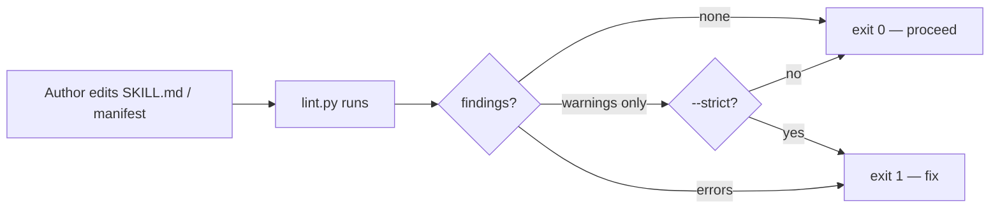

# skill-linting

Runs the **automated structural checks** for skills in this marketplace. The companion to `skill-authoring`: that skill *states* the rules; this one *enforces* them.

The deliverable is a Python script at [`scripts/lint.py`](../../scripts/lint.py) — zero deps, stdlib only — invoked from the slash command, the Makefile, the pre-commit hook, and (eventually) CI. This `SKILL.md` describes when to run it, how to read its output, and how to fix common findings.

## When this skill applies

The description above lists trigger phrasings. The short version: anything that touches a `SKILL.md`, plugin manifest, marketplace manifest, or reference file in this repo.

Invoke it explicitly:

```
/skill-linting:lint                        # all skills in repo
/skill-linting:lint <plugin-or-skill-path> # narrow to a path
```

Or via the Makefile / pre-commit (see `references/ci-integration.md`).

## What this skill does NOT do

- **Not a markdown linter.** Doesn't check headings, line length, prose style, or markdown syntax. Use a generic markdown linter (`markdownlint-cli`, `vale`) for that.
- **Not a code formatter.** Doesn't touch indentation, JSON formatting, or whitespace.
- **Not a content reviewer.** Doesn't judge whether a skill is *good* — that's `skill-authoring`'s job. This skill checks structural correctness.
- **Not a security scanner.** Doesn't look for secrets, sensitive data, or suspicious content.

## Operating model



The script runs identically from every entry point — slash command, Makefile, pre-commit hook. The only thing that changes is the output format and the strictness flag.

## Two tiers of checks

### Tier 1 — Errors (block CI / pre-commit)

Mechanical, unambiguous, deterministic. Spec-mandated or repo-mandatory:

- Frontmatter parses as YAML.
- `name` is non-empty, ≤64 chars, lowercase + digits + hyphens, no consecutive `--`, not a reserved word, equals parent directory name.
- `description` is non-empty, ≤1024 chars, no XML/HTML tags.
- Combined `name + description` is ≤1,536 chars (Claude Code's documented listing-truncation cap; above it the description is guaranteed to truncate). The companion warning `frontmatter.combined.margin` fires at 1100 to leave headroom under context-budget pressure.
- SKILL.md body is ≤500 lines.
- `plugin.json` parses; `name` matches plugin directory; `version` present.
- `marketplace.json` parses; every plugin on disk has an entry; every entry resolves; `source` paths correct; `version` synced with each plugin's `plugin.json`.

### Tier 2 — Warnings (surface, don't block by default)

Heuristic or judgment-shaped. The `--strict` flag promotes warnings to errors:

- Description starts in third person (heuristic: flags `I `/`You `/`We `/`Let me `/`This skill ` openings).
- Description has an exclusion clause (looks for `Not for…`, `Do not use for…`, `Does not trigger on…`).
- Reference files >100 lines have a `## Contents` heading in the first 30 lines.
- Reference depth = 1 (warns on cross-references between sibling files; Anthropic's own skills follow a strict hub-and-spoke pattern with zero sibling cross-references — the warning surfaces deviation from that house style).
- References are linked from SKILL.md or the plugin README (no orphans).

The full check catalog with rule IDs, rationale, and fix recipes lives in [`references/checks-reference.md`](references/checks-reference.md).

## How to run it

```bash
# All skills in the repo (default)
python3 plugins/skill-linting/scripts/lint.py

# Narrow to one plugin or one skill
python3 plugins/skill-linting/scripts/lint.py plugins/architecture
python3 plugins/skill-linting/scripts/lint.py plugins/authoring/skills/skill-authoring

# Strict (warnings count as errors — exits 1 on any finding)
python3 plugins/skill-linting/scripts/lint.py --strict

# Output formats
python3 plugins/skill-linting/scripts/lint.py --format github   # GHA annotations
python3 plugins/skill-linting/scripts/lint.py --format json     # for tooling

# Limit severity reported (default: warning)
python3 plugins/skill-linting/scripts/lint.py --severity error  # tier-1 only
```

Exit codes:

- `0` — no findings, or only info-level, or only warnings without `--strict`.
- `1` — tier-1 errors, or warnings with `--strict`.
- `2` — fatal (no marketplace.json found, manifest unparseable, etc.).

## How to fix common findings

Each finding includes the rule ID; full fix recipes are in `references/checks-reference.md`. The most common ones, summarized:

| Rule | Fix |
|---|---|
| `frontmatter.description.length` | Trim by the over-cap delta. Drop redundant adjectives, merge clauses, or factor methodology into the body. |
| `frontmatter.combined.length` | Trim — combined exceeds 1,536, the documented hard cap. The listing will truncate. |
| `frontmatter.combined.margin` | Trim toward ≤1100 (target). Anthropic's own skills sit well below this margin; under context-budget pressure descriptions can truncate before the hard cap. |
| `frontmatter.description.xml` | Replace `<placeholder>` syntax with `{placeholder}`, `[placeholder]`, or quoted prose. Angle brackets read as XML tags. |
| `frontmatter.description.exclusion-clause` | Add a final sentence: `Not for X, Y, or Z.` Naming 3–5 near-miss phrasings. |
| `frontmatter.description.third-person` | Rewrite as third-person verb form: `Authors and reviews…` not `I help you author…`. |
| `frontmatter.name.parent-dir-mismatch` | Rename either the directory or the frontmatter `name` to match. |
| `body.length` | Factor content into `references/`. Don't compress prose; split topics. |
| `marketplace.plugin.version-sync` | Bump both `plugin.json` and the marketplace.json entry to the same version in one commit. |
| `reference.toc.missing` | Add `## Contents` heading near the top with bullet links to each H2. |
| `reference.depth` | Restructure toward hub-and-spoke: inline the linked content into the parent reference, or have `SKILL.md` link both files directly so neither needs to point at the other. Anthropic's own skills carry zero sibling cross-links. |
| `reference.orphan` | Add a link from `SKILL.md` (preferred) or the plugin `README.md`. |

## Disabling checks responsibly

Single mechanism: `.skill-lint.toml` at repo root.

```toml
[disable]
checks = ["frontmatter.description.exclusion-clause"]    # repo-wide

[per_skill."plugins/architecture/skills/architecture-review"]
disable = ["body.length"]
reason = "Phase definitions are load-bearing; factoring further breaks compaction"
```

The `reason` field is a documentation convention — not enforced today, but every disable should ship with a short justification so suppressions stay auditable. There is no per-line `noqa` mechanism: disabling a check is a structural decision that belongs in version-controlled config, and inline lint metadata would pollute Claude's context every time a skill loads. See [`references/disabling-checks.md`](references/disabling-checks.md) for the full schema.

## Operating principles

1. **Scripts state what's true; SKILL.md states why.** This SKILL.md is operating instructions for using the linter. The actual rules live as code in `lint.py` (the source of truth) and as documentation in `references/checks-reference.md` (human-readable).

2. **Tier discipline is load-bearing.** Tier 1 = mechanical, unambiguous, blocking. Tier 2 = heuristic, judgmental, surfacing. Don't promote a check to tier 1 because "it would be nice to enforce" — promotion requires the check to be deterministic with zero false positives.

3. **Disabling is auditable, never silent.** Every `noqa` comment is on the line it disables; every config disable should ship with a reason. Reviewers should question wholesale disables.

4. **Zero deps.** The linter must run anywhere with Python 3.11+. No `pip install` step, no virtualenv. Adding a dependency is a design decision that requires a real reason.

5. **Findings include their fix.** Every check that emits a finding includes (or points at) a concrete fix. "Description over cap" is useless without "trim by N chars".

## How to invoke

Auto-triggers on the phrasings in the description above. Explicit invocation:

```
/skill-linting:lint              # all skills
/skill-linting:lint <path>       # specific plugin or skill
```

Or as the underlying script:

```bash
python3 plugins/skill-linting/scripts/lint.py [PATH ...] [--strict] [--format ...]
```

## Reference & template files

Loaded on demand:

- [`references/checks-reference.md`](references/checks-reference.md) — **The check catalog.** Every rule with severity, what it catches, why it matters, how to fix, how to disable. Read this when interpreting a finding or considering a new check.
- [`references/ci-integration.md`](references/ci-integration.md) — **Wiring the linter into local dev and CI.** Makefile target, pre-commit-config snippet, GitHub Actions workflow. Read this when setting up or extending the integration surface.
- [`references/disabling-checks.md`](references/disabling-checks.md) — **`noqa` and `.skill-lint.toml` semantics.** When and how to disable checks responsibly. Read this when justifying a suppression.

Templates:

- [`templates/skill-lint-config.md`](templates/skill-lint-config.md) — annotated `.skill-lint.toml` example.
- [`templates/makefile-target.md`](templates/makefile-target.md) — Makefile snippet wiring `make lint-skills` and `make ci`.
